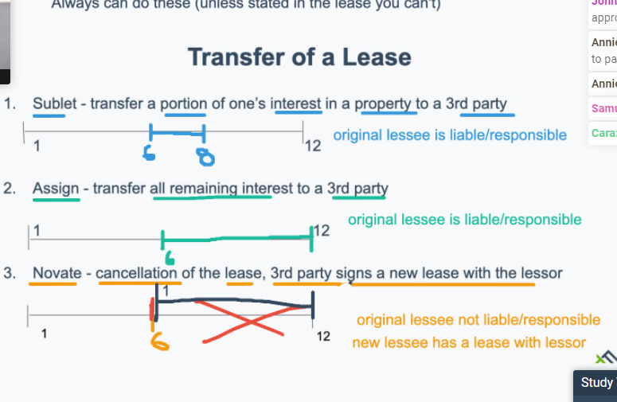

# Class 10 Leases 

page.43 

## Lease

* Leases are a non-freehold interest in real estate

  > non-freehold -> possession & use 

* Synonyms for lease

  Rental, Leasehold, Tenancy for Years, Estate for Years, Interest in Years, Demise, Non-Freehold

* What are leases?

  * Written conveyance of possession and use of real estate for some specific period of time

  * Privity of Estate: legal relationship between two parties interested in the same property

  * Subject to the Essentials of contract

    > Covered in greater detail in contracts

    1. Offer & Acceptance
    2. Consideration ($$)
    3. Legal Object
    4. Reality of Consent & competence

* Essentials of a Lease
  * Sufficient description of premises -address
  * Rental Amount - how much/when payment is made
  * Terms of Lease - dates
  * Intention to Rent (Mary Intents to rent to Joe)
* Parties in lease
  * Lessor: Landlord       Lessee: Tenant
* Leases longer than **7 years** must be recorded in MA
* Leases can't last more than **99 years**

* Lessor is liable for and insures common areas (entry lobby, common laundry, parking)
* Lessee is liable for and insures leased premises (rental unit)

* Commercial Leases
  * Usable Square Footage: Space that the lessee can occupy and is responsible
  * Rentable Square Footage: Both the leased premises and a percentage of the common areas used by lessee, but maintained by the lessor
* Lessor retains reversionary interest under the lease
  * tenants who stay past their lease are tenants at sufferance
* **Leases run with the land**
  * Certificate of no defense/Estoppel Certificate
* Why does the Doctrine of Estoppel Exist
  * Goal: prevent the tenant from trying to renegotiate or defraud new property owner

## Transfer of a Lease

1. Sublet - Transfer a portion of one's interest in a property to a 3rd party

2. Assign - transfer all remaining interest to a 3rd party

3. Novate - cancellation of the lease, 3rd party signs a new lease with the lessor

## Lease Termination

Aside from Novation, a lease can be terminated in a variety of ways:

1. Performance - Lease automatically terminates at end of term
2. Surrender - cancellation of lease prior to expiration
3. Action of Law - eminent domain taking, tax sale, bankruptcy
4. Destruction - property is destroyed 
5. Foreclosure - banks have right to cancel the lease
   * Under Protecting Tenants at Foreclosure Act of 2009: res. leases can survive unless the buyer at foreclosure is going to use it as their primary 

#### Continue

##### Actual Eviction

* Lease has been breached by the tenant
* For non payment of rent
  * Next steps for lessor

1. 14 days notice to quit in writing
2. Unlawful detainer complaint (summons)
3. Housing Court - Hearing Held
4. Eviction
   * must use constable to remove tenant and their belongings from property

##### Constructive Eviction

* Permits Lessee to vacate premises and ends obligation to pay rent due to lessor's violation of the covenant of Quite Enjoyment

Covenant of Quiet Enjoyment

* Undisturbed enjoyment of leased property
* Property is maintained up to sanitary and building ocdes
* Lessor doesn't lease to others
* Lessor doesn't threaten expulsion
* Lessor doesn't trespass
* Service promised in the lease are provided.