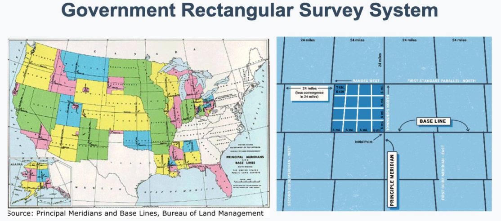
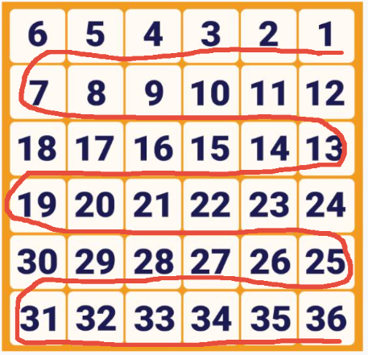
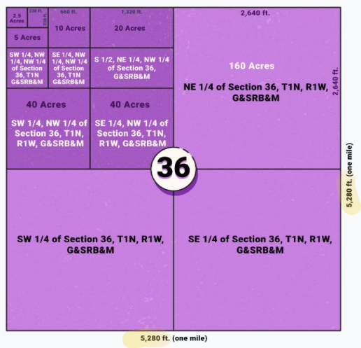

# Class 11 Transfer of Property Part 1

Study guide p.49

## Transfer of Property

* How is real estate transferred?
  * Conveyed with a Deed
* What are deeds?
  * Legal document that transfers title, or ownership - like a receipt
* What is the difference between a deed and title
  * the deed is physical document, where "title" is a **concept**. Concept of ownership
* Who are the parties involved in a title transfer
  * Grantor ("or" give):  typically, a seller (or owner)
  * Grantee("ee" accept): typically, a buyer 

## Title

- Title = ownership  (the concept of ownership)
- A property owner can lose title
  - Involuntary Alienation
    - Forced loss of ownership (Foreclosure or Tax sale)
  - Voluntary Alienation
    - Willing loss of ownership

## Deed

#### Purpose of a Deed: 

document that transfers title - ownership

#### Deeds Essentials:

* Must be in writing
* Grantor must be legally competent
* Signature of the **grantor**
* Must name Grantee
* Involve the exchange of of *consideration* 
* Include a full legal description of land
* Include a granting clause
* Delivery and acceptance 

> Grantee signature is not required.
>
> Date is not required

## Recordation

* What is recordation?
  * Act of making title transfer public record at county registry of deeds
  * Provides constructive notice = public notice
    * As compared to actual notice = told something specifically 
* Recordation is recommended, but **NOT required** 

## Land Description & Surveys

* Full legal land description (one of the essentials of a valid )

#### Land Survey Measurements

You might see a number of units of measurement used in the survey. They are:

1 link: 7.92 inches (call it 8 inches for memorization)
1 foot: 12 inches
1 yard: 3 feet
1 rod: **16 feet 6 inches**
1 chain: 66 feet
1 furlong: 660 feet
1 mile: **5,280 feet**
1 acre: 43,560 square feet (1 chain x 1 furlong)
1 square mile: 640 acres  (5280^2=27,878,400/43,560=640)

#### Metes and Bounds

* Metes and Bounds Survey (used in the original 13 colonies)
  * Most common land description
  * Point of beginning and the ending are always the same
  * Lot lines or boundaries of the property are always description

An example metes and bounds survey might read:

> "A plot of land located in Boston, Suffolk County, Massachusetts, beginning at the intersection of Canal and Causeway
> Street, running south along Canal Street 304 feet, West to Friend Street 150 feet more or less, North to the intersection of
> Causeway Street and Friend Street, then East along Causeway Street to the intersection of Canal and Causeway Street."

#### Lot and Block

Plat maps are another method of surveying land. They are the recorded plans for a subdivision or municipality, and use the lot and block method. The lot and block method divides the property by streets into blocks, and then subdivides those blocks into lots using the metes and bounds method for each individual lot. The total area of the parcel of land is also described using a metes and bounds survey. 

An example Lot and Block survey might read:

> "Lot 43, Block 17, Green Acre Homes in the City of Portland, according to the plat thereof, recording in Volume 6 of plats, page 84, in Multnomah County, Oregon."

#### Government Rectangular Survey System

- Squares created by the intersecting of tiers and range lines = townships
- Townships are 6 miles x 6 miles
  - Contains 36 square miles (23,040 acres) 

* Townships = divided into 36 **sections**

  * Sections = 1 mile x 1 mile  (**640 acres**)
  * Numbered 1-36
  * Northeastern Corner always #1
  * 16th section = school section

  

* Section are divided into
  1. Halves of 320 acres
  2. Quarters of 160 acres
  3. Further subdivided into quarters and halves

* Sizes for each area in a Government Rectangular Survey 
  * Quadrangle/Check: 24 miles by 24 miles, 576 square miles, or 368,640 acres
  * Township: 6 miles by 6 miles, 36 square miles, or 23,040 acres
  * Section: 1 mile by 1 mile, 1 square mile, or 640 acres
  * Half-Section: 1 mile by ½ mile, ½ square mile, or 320 acres
  * Quarter Section: ½ mile by ½ mile, ¼ square mile, or 160 acres
  * ½ of a Quarter Section: ½ mile by ¼ mile, 1/8 square mile, or 80 acres
  * ¼ of a Quarter Section: ¼ by ¼ miles, 1/16 square mile, or 40 acres

## Types of Deeds

#### General Warranty Deed

= warranty Deeds

* Grantor accepts all liability and offers extended warranties

#### Special Warranty Deed

* Grantor is only liable for any title claims that originated during the ownership
* Grantor promises they did not cause any title issues

#### Bargain and Sale Deed (court)

* Grantor states they have a right to convey ownership, even if they do not own the ownership

#### Quitclaim Deeds = Non warranty Deed

* Grantor offers no warranties and is not liable for any claims against title
* Grantor conveys only the interest he/she has at the time of transfer
* Most commonly seen in bank foreclosures or to correct a mistake in public record

> In MA - This is the same as a special warranty deed, with title insurance

#### Deeds of Trust or Trust Deed (not tested)

#### Reconveyance Deeds

* Trustees will often use this type of deed
* Used to return property to trustors

#### Trustee's Deeds

* Executed by a trustee to transfer real estate to anyone who isn't the trustor

#### Deeds executed pursuant to a court order

* Issued as a result of the order in a will or a court