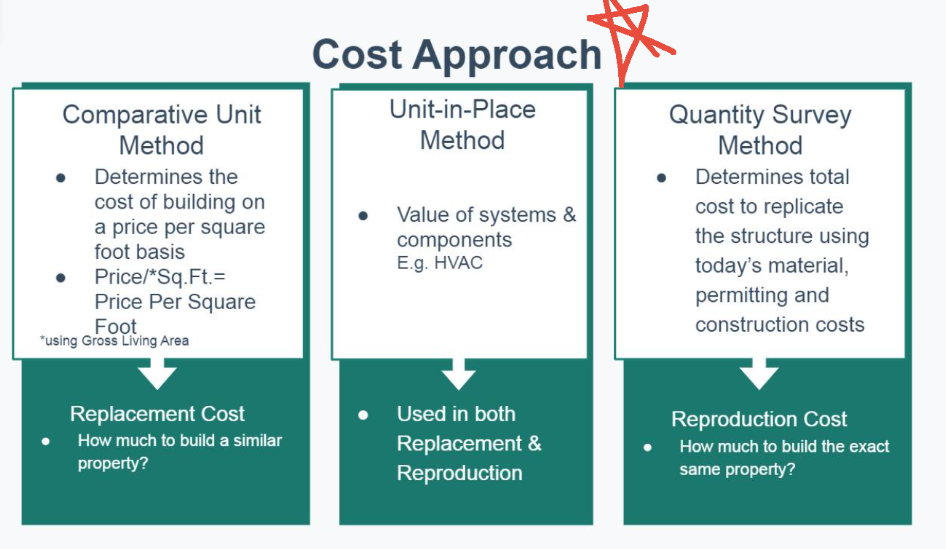

# Class 12 Property Valuation Part 2 (need review)

#### empty

## Capitalization Rate

* Another way to value investment property
* Capitalization Rate/Cap Rate = the percentage of the property value that an investor expects to receive as NOI every year
  * More reliable than GRM
  * Investors usually have a goal cap rate
  * Formula: NOI/Sales price

#### Capitalization Rate Math

Formula: NOI/Sales Price = Cap Rate

## Cash on Cash Return

* Most popular investment value options for investors
* Most on Cash Return = return on investor's cash investment
  * Helps investors determine how their real estate is performing
  * Percentage of total investment received as annual cash flow (before taxes)
  * Formula: Cash Flow before taxes/ Dollars Invested= Cash on Cash return
* Ideally, investors want cash on cash return to be higher  than cap rate
* Cash flow after taxes will change anytime a debt service payment is made

#### Cash on Cash Return Math

Formula: Cash Flow/Dollars Invested = Cash on Cash return 

## Cost Approach

* Cost Approach = using the cost of construction to estimate value
  * Used for unique properties with no comps or income
  * e.g. a church or brand new construction

#### Math

Example of final real estate value using cost approach

$520,000 Estimated replacement/reproduction cost

-$60,000 Less depreciation costs

___

$460,000 Estimated improved value of property

+$92,000 Land value (calculated using sales comparison approach)

---

$552,000 Final estimated real estate value

## Cost Approach

#### Math

* Example of Final 

## Quiz

