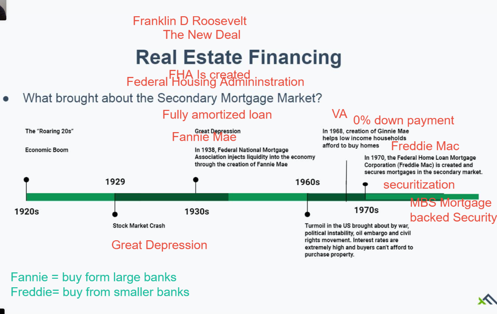
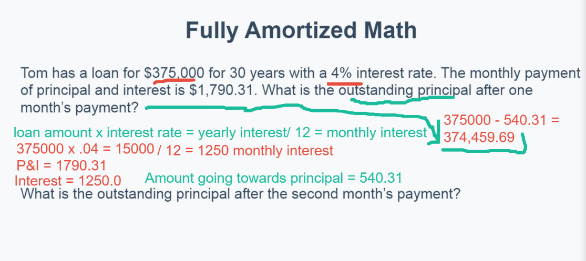
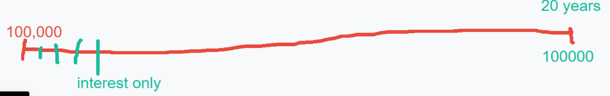

# Class 14 Real Estate Financing

Study guide p.69   Feb 23

## Outline

## Real Estate Financing 

* When a buyer receives financing for a home, the money doesn't always come from the same bank where they applied for the mortgage
  * Portfolio loans = loans that a bank keeps & services in house
* Secondary Mortgage Market
  * Where banks sell loans to  investors
* Mortgagor forwards future mortgage payment to new owner
  * Mortgagor doesn't need to consent to the sale of their loan
  * Helping Families Save Their Homes Act
  * Certificate of no defense/Estoppel Certificate

* Who Brought the Secondary Mortgage Market

## Fully Amortized Loans

* Fully Amortized Loans Vocabulary
  * Amortization = payment of debt in equal payments
  * Debt service = PRincipal and Interest
  * Principal = amount borrowed (debt) or loan amount 

* Fully Amortized Loans = loans that are completely paid off when last payment is made
  * Also know as **Direct Reduction Loans**
  * Debt service pays both principal & interest
* PITI Payment
  * Principal
  * Interest
  * Taxes
  * Insurance (home owners insurance)

* How to fully amortized loans work?
  * Every mouth the same payment is made but the amount going towards principal and interest will change and at the last payment the loan is paid off in full
* Amount going toward principal & interest changes over the life of the loan
  * Recalculated monthly
  * Only **12 days** in a calendar year for calculation

* Principal payments are always residual
  * Difference between total payment & interest due
* With each payment made, amount of money going toward principal increases, while the amount going toward interest decreases
  * Final payoff = discharge

## Math using the amortization table

Formula = (loan/1000)* PI = monthly payment

* Fully Amortized Math

  

Second month payment 

$374,459.69*0.04 = 14978.39/12 = 1248.20$ (interest)

P&I=1790.31

Interest=1248.20

Amount to principal = 542.11

* Practice time

373,917.57*0.04=14956.70/12=1246.39

Amount to principal = 1790.31-1246.39=543.92

Answer: $373,917.57-543.92=373,373.65$ 

## Fixed vs Adjusted 

* A loan can be either fixed rate or adjustable rate
* Fixed Rate
  * Interest rate doesn't change over the life of the loan
* Adjustable Rate
  * Interest rate is usually lower in the beginning
    * Teaser or discounted rate
  * Interest rate adjusts based on prime rate(e.g. prime + 2pts)
  * Payment caps
    * If increase is higher than cap, bank will carry it over to next rate increase

## Types of Real Estate Financing

* Balloon Loans
  * Amortization period is longer than pay period
  * Balloon = unpaid principal at the end of the term

* Straight & Simple Interest Loans
  * Interest only loans
  * Non compounding debt calculated daily
  * Principal paid in one lump sum at the end of term

* Second Mortgages = Junior Liens
  * HELOC, Equity Line, Line of Credit， Open End Mortgage
  * Borrower is given line of credit against their equity

* Graduated payment loans (Dr.)

  * Monthly payment is lower in the beginning & increases as the homeowner makes more money
  * Used for homebuyers with **predictably rising incomes** (e.g. doctors)
  * Negative amortization of interest

* Growing Equity Mortgage

  * Extra payments are made toward the principal
  * Homeowner will pay off loan faster

  *predetermined schedule of payments*

* Reverse Annuity Mortgage 

  * Bank makes payments to the borrower (homeowner) against the equity in their home
  * Must be **62 years** old to use
  * Loan plus interest must be repaid when home is sold or homeowner passes

  *Typically within 12 months of person dying*

## Types of Seller Financing for Real Estate

* Purchase Money Mortgage = Seller Financing

  * Seller = Mortgagee, Borrower = Mortgagor

  *Seller acts as bank or lender*

  *Buyer gives the seller a Note and a Mortgage*

* Wraparound Mortgage (Seller Financing)

  * Seller "wraps" their existing debt around the borrower new loan
  * Helps seller pay off their existing debt while making extra money from seller financing arrangement 
  * Seller keep the loan in place with current lender

  

  Seller makes 2% on 180K, 6% on 50K

* Construction Loans

  * Borrower receives funds in draws
  * Loan typically get replaced once construction is complete

* Package Mortgage

  * Covers real and personal property (real and equipment)

* Chattel Mortgage

  * Secured by personal property only

* Blanket Mortgage

  * Used for development of subdivisions where there are multiple lots
  * includes Partial Release Clause

* Non-Recourse Loan

  * Borrower not personally liable for on loan deficiency after foreclusure
  * Only the property is the security for the loan

* Bridge Loans or Swing Loans

  * Short term loans

  * bridge the borrower over some gap in cash flow

    > e.g. a shortfall in construction between stages of a project

  * Swing loans are a type of bridge loan that allow a homebuyer to borrow against a new home they're purchasing to carry two mortgages while they sell their old home

* Participation Mortgage

  * Lender participates as an equity partner in a development 

* Shared Appreciation Mortgage

  * Investor makes a down payment for a buyer in exchange for share in property equity

* Buy Down

* Take over Mortgage  (seller cannot have a due on sale clause)

  * Subletting of the mortgage
  * Buyer takes over seller's debt & original loan stays in place
  * Buyer would pay seller their equity & receive a deed along with right to redeem title after paying off loan
  * FHA loans that originated prior to 1989

  There are three methods of taking over the seller's lien:

  * Subject to – Only the original mortgagor is legally responsible for the loan, and is liable if there is a deficiency after a foreclosure auction. Best for the buyer.
  * Assumption of – Both the original mortgagor and new owner are responsible for the loan, and any potential deficiency. The buyer and seller are jointly responsible.
  * Novation – The seller's note is cancelled, and a new note is written between the lender and the new buyer. Only the buyer is responsible for the debt; the seller is released from their obligations. Best for the seller.

  

jane@rightkeymortgage.com