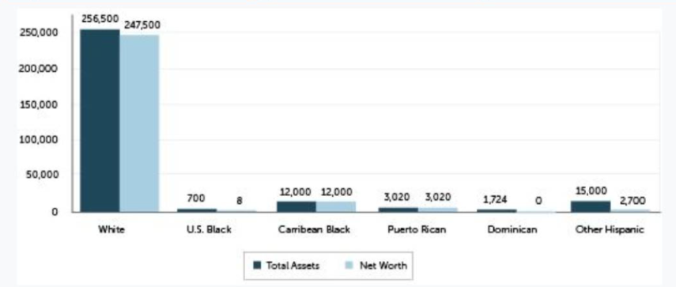
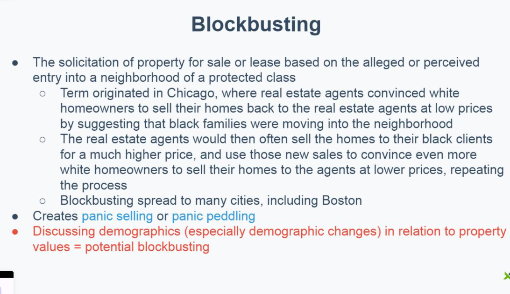
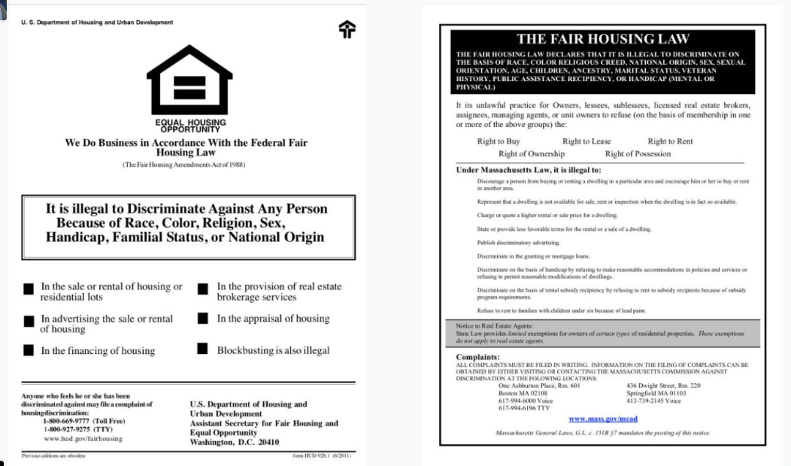

# Class 20 Introduction to Fair Housing

Feb 18 Study P.62

## Fair Housing Law Basics

* What is the purpose of fair housing law?
  * to ensure equal opportunity 

## Why is fair housing law important?

* Shelter is a basic necessity
* Housing is a major contributor to wealth and education
  * Primary residence = single largest contributor to most households' net worth
  * School funding = primarily determined by local property taxes
* **Discrimination was historically prevalent and permitted**

* US Federal loan programs (FHA, VA) officially denied and limited lending in non-white communities 
* Housing developments law
* Next slides are excerpts from the 1936 edition of the Federal Housing Admin Underwriting Manual
* 

* **Many types of discrimination are now illegal, but are still prevalent** 

* A 2019 undercover investigation of real estate agents on Long island found that they:
  * Discriminated against
    * 19% of Asian clients
    * 39% of Hispanic clients
    * 49% of black clients
  * Directed white and non-white clients to different neighborhoods 24% of the time ("steering")
  * Provided white clients with 50% more listings on average than black clients

* A 2017 Suffolk Law study found that transgender and gender non-conforming renters were discriminated against 61% 
* The fair Housing Center of Greater Boston found that:
  * Families with children were discriminated against 33%
* A 2020 joint study by The Boston Foundation, Suffolk Law, and The Analysis Group found that in the Greater Boston area:
  * 71

* The impacts of this historical and present day discrimination are significant
* Example: median net worth in Boston (2017)

## Federal Fair Housing Laws

## Quiz:

1. Fair housing outlaws discrimination based on: (Protected Classes)

> Fair housing law outlaws discrimination on the basis of certain protected classes (groups of people).

2. The Massachusetts fair housing law is: (MGL 151B)

# Class 21 Fair Housing Law

feb 18

## Federally Protected Class

Under the Fair Housing Act and Amendments, the federally protected classes are:

* Race 
* Color
* National Origin
* Religion
* Sex (male/female)
* Familial Status
* Disability

## ADA (Americans with Disabilities Act)

* After March 31 1991, all new or renovated residential 4+ unit house must have accessible design features for 1st floor and any floors serviced by an elevator
* Reasonable mod of residential rentals must be permitted by the landloard
  * can be at the tenant's expense
  * can be required to be returned to original condition upon move-out
* Commercial properties built or renovated after 1991 must be accessible
  * Businesses open to or that serve the public = public accomodations
  * Both landlord ....

### Service and Support Animals

#### Service Animals

* Trained to perform a specific task(s)
* Can ask:
  * Is it a service animal?
  * What tasks does it perform? (*Only if the task is not OBVIOUS*)

#### Support Animals

* **Any animal** a health care professional designates
* For emotional support, PTSD, etc.
  * E.g. emotional support animal

* Can ask:
  * For a note from a health care professional
  * Can never ask for the reason or mention disability

## MA Fair Housing Law

* MGL 151B  
  * Org passed (1946)
  * Covers more than just real estate
* MA protected class are 
  *  race, 
  * color, 
  * sex, 
  * national origin, 
  * religion, 
  * disabilities, 
  * familial status, 
  * age, 
  * marital status, 
  * sexual orientation, 
  * public assistance status, 
  * gender identity, 
  * veteran status, 
  * genetic information, and 
  * ancestry.

## Public Assistance Program

* Public Assistance = receiving housing or other government assistance
  * Discrimination based use of public use of public assistance is illegal in MA
* MassHousing
  * Provides financing for affordable housing
  * Oversees affordable housing developments
  * Provides low down payment load options for first time home buyers
* Section 8
  * Federal program that provides housing assistance
  * Voucher system that subsidizes rentals with private

## Exemption to FHL

* Exemptions are never allowed based on race (Federal & MA)
* Exemptions are never allowed based on public assistance statue (MA only)
* Advertising is never exempt from fair housing law
* Licensed real estate agents must **always follow fair housing laws**
  * No exemptions are ever permitted for real estate agents
  * People who hire a real estate agent may not use any exemption

#### Federal Exemptions

* Private individual who owns <= 3 single family homes (can't have sold more than 1 in the last 24 months)
* Rentals in owner-occupied 2-4 family homes
* Federally approved housing developments for seniors or retirees are exempt from familial status under Housing for Older Persons Act of 1995
  * 100% occupancy of 62+ years old residents
  * 80% occupancy of 55+ years old residents

#### MA State exemptions

* No exemptions for single family home owners
* Rentals in owner-occupied 2 family homes only
* State approved housing developments for the senior or retirees are exempt from familial status and age under Housing for Older Persons Act of 1995
  * Same % occupancy requirements as federal

## Exemptions to Fair Housing Law

Both Federal and State exemptions include: 

* Religious organizations that offer housing to their members 
  * Must be for non-commercial purposes

## Quiz

1. If a client arrives to an appointment to view apartments and brings their dog wearing a service animal vest with them, what should the real estate agent do? (nothing)

> Explanation: In order to avoid a fair housing violation, if someone brings a dog that is obviously a service animal, such as one wearing a service animal vest, you should never ask if it's a service animal.

2. Katie is the owner of a 3 family property in Boston, MA that was built in 1930. She wants to rent our her first floor aparment and since she lives on the 3rd floor of her home, she would have the Fair Housing exception to do what? (nothing)

> The owner-occupied fair housing law exception only applies to 2 family properties in Massachusetts. Katie would not be able to utilize any of the exceptions if she owns a 3 family.

# Class 22 Fair Housing in Practice

## Federally Protected Classes

Quick review: **Federally protected classes**

* Race 
* Color
* National Origin
* Religion
* Sex (male/female)
* Familial Status
* Disability

## MA Fair Housing Law

MA Protected classes

*  **race,**
*  **color,** 
*  **sex,** 
*  **national origin,** 
*  **religion,** 
*  **disabilities,** 
*  **familial status,** 
*  age, 
*  marital status, 
*  sexual orientation, 
*  public assistance status, 
*  gender identity, 
*  veteran status
*  genetic information
*  ancestry.

## Differentiation on Terms or Conditions

Cannot impose different or additional requirements on someone based on a protected class

## Discriminatory Advertising

* Illegal to specify preferences or limitations based on a protected class
  * e.g. "empty-nesters" (familial status), "immigrant community" (national origin), or "no drinkers" (disability; alcohol addiction)
* illegal to target or exclude protected classes
  * e.g. HUD lawsuit Facebook for real estate ad targeting

* Covers ALL advertising, not just print, TV, and ratio
  * Includes MLS postings, online listings, social media, websites, etc

## Advertising Best Practices

Best practices from the National Fair Housing Alliance:

* Focus on the property, not an ideal renter or people in the area
* **Do not state a preference for or exclude certain groups of people**
* Include the fair housing logo and /or equal housing opportunity tagline
* Do not exclude protected classes using ad targeting
  * Advertising in a foreign language is legal, so long as the advertisement contents comply with fair housing laws
* If an adver

## Falsifying Availability

* Most often lying about a property being unavailable to avoid working with a member of a protected class
  * e.g. saying that a property has already been rented to unlawfully avoid renting to a tenant using section 8
* In MA, records of property availability must be kept for 3 years after advertisement

## Blockbusting

which is any solicitation of property for sale or lease on the grounds of an alleged change in property values due to the presence or prospective entry into a neighborhood of people covered by a protected class. It creates panic-selling (also known as panic peddling)

## Steering

* Directing someone toward, or away from, neighborhoods based on a protected class
  * E.g. only showing Hispanic clients properties in Hispanic-majority neighborhoods
* **Do not make assumption about where your clients want to live**
* **Do not limit the listings or areas you share with your clients if they meet your clients' specifications**
* **Do no provide your clients with demographic information**
* **Avoid opining about neighborhood safety**
* **Avoid opining about school districts**
  * Do not discuss school demographics

## Restrictive Covenants

* Shelley vs Kraemer
  * Supreme Court casein 1948 that made racially restrictive CC&Rs illegal
  * Refresher: CC&Rs = covenants, conditions and restrictions

## Professional Organizations

* Realtors, MLS, local professional groups, etc. Cannot limit membership based on a protected class

## Fair Housing Posters

* A **HUD Equal Housing Opportunity Poser** must be posted in every real estate office

* An **MCAD fair Housing Law Poster** must be posted in every real estate office

## Penalties and Violations

* Any person may file a complaint with the **Department of Housing and Urban** Development (HUD)
  * Within 1 year of the alleged date of discrimination
  * Testing is permitted  (HUD/MCAD/Private Groups)
* A HUD **Administrative Law Judge** (ALJ) can fine:
  * 1st  offence: up to **$16,000**
  * 2nd up to **$37,500**
  * 3rd up to **$65,000**
  * Additional **civil penalties** between **$50,000 - 100,000**
    * No specific limit on damages
    * Potential criminal penalties if a federal lawsuit is filed within 2 years
* *Massachusetts Commission Against Discrimination (MCAD)* findings against an agent result in an **automatic license suspension** for:
* 1st offense: **minimum of 60 days**
* 2nd offense in 2 years: **minimum of 90 days** 

## Best Practices

* Treat all of your clients and customers the same
* Create checklists and standards of service for everyone to avoid discrimination made through implicit bias
* Add the **HUD Equal Opportunity Housing Logo** to your email signature
* Talk about properties, not people
* **Do not make assumptions**
* **Always follow the law**

## Quiz

* Sasha tells her real estate agent, Jamie that it's important for her to live in a neighborhood with lots of other families so that her daughter can make friends easily. She's also looking to spend up to $600,000 for a relatively renovated home that has at least 2 bedrooms and 2 bathrooms and a level backyard. Jamie gives Sasha a **list of 5 towns** that would best meet her and her daughter's needs and when Sasha narrows down the list of towns to just 3, Jamie sends her all of the available properties that meet her criteria. Has the real estate agent risked their license?
  * Yes because the agent has engaged in steering

> Cannot give list of town based on protected class

