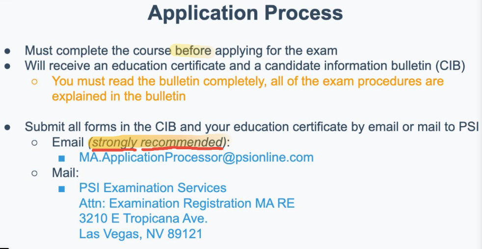
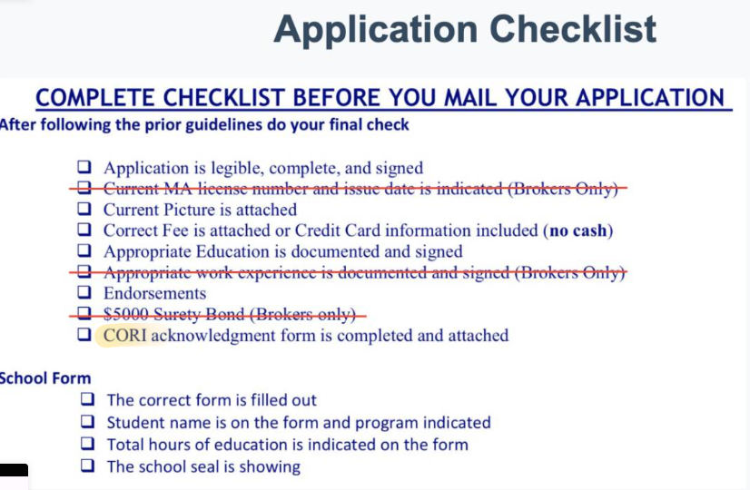
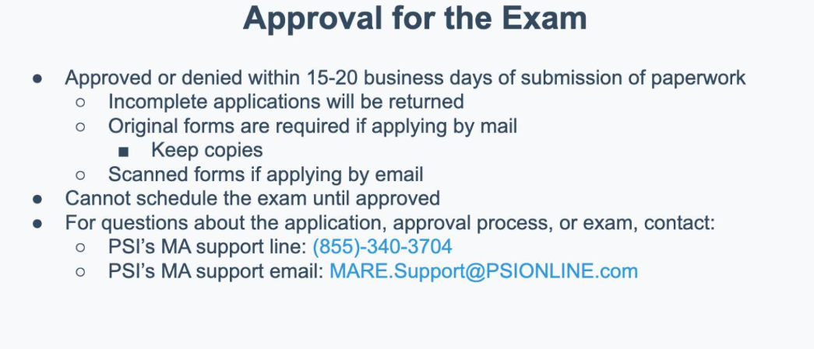
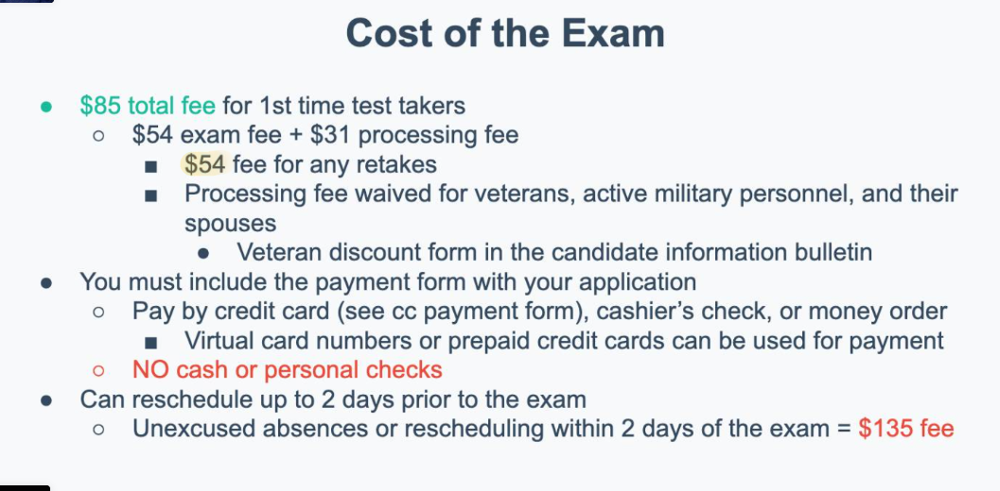
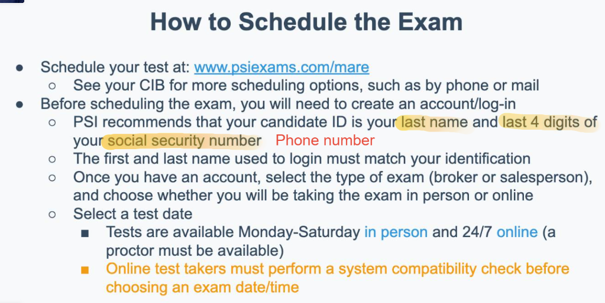
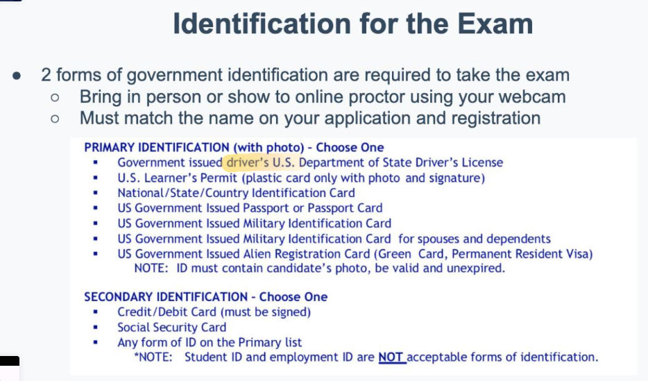
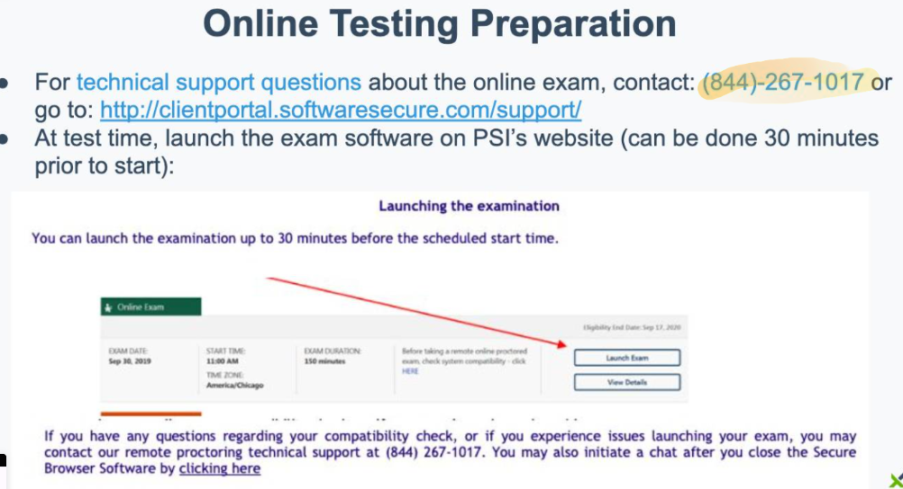
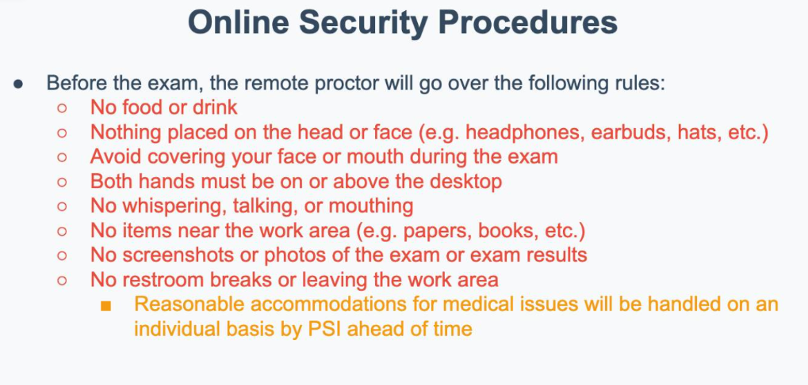
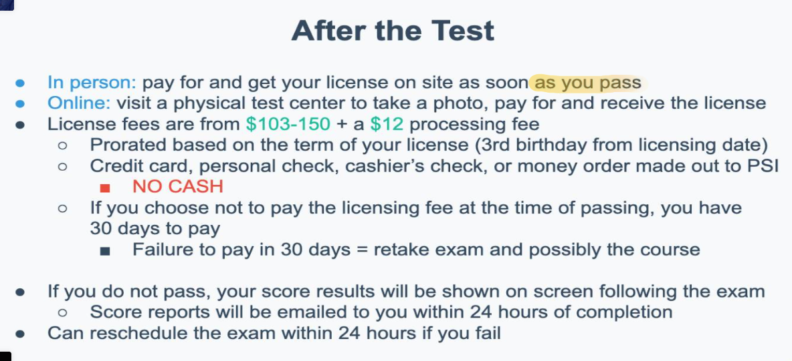

# Class 24 The Massachusetts Real Estate Test

## Test Topics - General

## Test Topics - State

* Duties and Powers of the Board - 5%
* Licensing Requirements - 10%
* Requirements Gornvering 

##  Requirements to Take the Exam

## Application Process

## Application Checklist

## The Application

### Photo

## The Application 

### References

### CORI Form

#### Criminal History

## Approval for the Exam

## Cost of the Exam

## How to Schedule the Exam

## Identification

## Online Testing

## Online Security Procedures

## Taking the Exam

## After the Test

