# This is the class notes for the Massachusetts Real Estate License Test

## Introduction 

The notes are from the "40 hours of real estate education". All the classes are taken from Freedom Tail Reality School. If you want to take the courses from them too, you can use my $20 [Coupon Code](https://www.bostonrealestateclass.com/referral/ma-salesperson/5fa062b9db5715000c612df6)

 The following is from [mass.gov](https://www.mass.gov/how-to/apply-for-a-real-estate-license):

> What you need for Apply for a real estate license
>
> If you want to become a broker or salesperson, you must meet the following requirements:
>
> The sales application requires:
>
> * **40 hours of real estate education**
> * Successful completion of licensing exams

# Table of Contents

1. [The Basics](#class-01-the-basis)
2.  [Property Rights](#class-02-property-rights)
3.  [Interests in Real Estate](#class-03)
4.  [Limitations on Property Rights Part 1](#class-0405)
5.  [Limitations on Property Rights Part 2](#class-0405)
6.  [Transfer of Property Part 1](#class-06)
7.  [Transfer of Property Part 2](#class-07)
8.  [Contracts](#class-08)
9.  [Contracts in Practice](#class-09)
10.  [Leases](#class-10)
11.  [Property Valuation Part 1](#class-11)
12.  [Property Valuation Part 2](#class-12)
13.  [Introduction to Real Estate Financing](#class-13)
14.  [Real Estate Financing](#class-14)
15.  [Government Financing Programs](#class-15)
16.  [Government Financing Regulations](#class-16)
17.  [Consumer Protection Laws](#class-17)
18.  [Real Estate Agency](#class-18)
19.  [Real Estate Agency in Practice](#class-19)
20.  [Introduction to Fair Housing](#class-20)
21.  [Fair Housing Law](#class-21)
22.  [Fair Housing in Practice](#class-22)
23.  Massachusetts Real Estate Licensing Law
24.  [The Massachusetts Real Estate Test](#class-24)

# Class 01 The basis

### Real Estate Transactions

1. list the property
   MLS - syndicate to other real estate websites
2. Advertise
3. Quality + Show 	
4. Offer
5. Purchase and Sales (P&S) (+ P&S Deposit)
   * real estate contract 
   * title search, appraisal(if financing), maybe Title V if private sewer, maybe 6D if condo smoke inspection certificate
6. Closing 
   * go on record = brokerage gets paid (broker pays salesperson)

### Real Estate Brokerage Relationship 

1. Client (seller_buyer_landlord/tenant)
   * principal: person who hiring 
2. Broker (Special Agent)
3. Salesperson (sub agent)

### Compensation

-  1099 independent contractor (self employed)
   * only paid when sales occurs
   * tax implications (quarterly tax payments)

> recommendation: hire accountant  
> 	take advantage of write offs (business expense)  
> 	track expense, keep recipes, mileage log, set aside tax $  

### Insurance

#### two main types:

general liability insurance
	* coverage for personal or property damage that might occur at the office/showing

* Prof Liability Insurance
  * errors and omissions or E&O
  * Errors and ommissions insurance is liability insurance that will cover mistakes made by a broker or their agents. 
  * E&O will not cover fair housing or consumer protection lawsuits. General liability insurance would cover personal property being broken

# Class 02 Property Rights

> Study Guide p.11  

## Outline

* Types of property
* Real property
* Air rights
* Mineral rights
* Riparian rights
* Littoral rights
* Personal Property
* Difference between real and personal property
* Exceptions to the rules
* Changing property types

### Types of Property

* Property = anything subject to ownership
* Two major types of Property
  * Real Property = land and everything with it
    * Real estate, realty, immovable property, fixtures
  * Personal property = anything ~not associated~ with LAND
    * personality, chattel, **moveable** property

### Real Property 

Transferred with a Deed
	* Deed = Receipt for real estate
		* conves legal title (ownership)
	* Grantor vs. Grantee

> or: giver.    ee: receiver  

### Bundle of Rights

Right to Possession (own it)
Right to Control (use it)
Right to  Enjoyment(use it in legal way)
Right to Exclusion (limit access to)
Right to Disposition (rent, sell, will)

### Extended Land Rights

1. Land rights (surface rights) 30ft below

* Appurtenances 
  * chimney, mail box
* Improvement (permanently attached to land) direct or indirect
  * Fixtures

2.  Air rights  (US v Causby)
    * tallest improvement 80ft ~ 500 ft.   (FAA navigable air space)
    * can be leased out
3. mineral rights (sub surface rights) 
   1. Solid mineral (Gold/silver/iron)

   2. liquid mineral (oil, gas) free flowing

   3. Implied easement 

      > An implied easement allows an owner who purchase mineral rights separately from the land itself to harvest those minerals automatically.

Rules of Capture
	1. Doctrine of Capture: you capture first, you get it first
	2. Utilization Pooling: share it, pool it

4. Riparians Rights (river)

   1. Ripariansm
      Use in the original 13 colonies 

   * non-navigable (mid points to mid) no boats
   * navigable (accretion line) boats

   2.  Doctrine of Prior Appropriation

   * Use for water rights in Western States
   * First come. First serve

5. Littoral rights

   * Littoral = **L**arge bodies of water (lakes, oceans and ponds)
   * accretion line (high tide)
   * *mass* (special)
     * extend from mean high water line to mean low water line or 100 rods / 1650 feet(whichever is less

6. Personal Property

   * any property not associated with land
   * Bill of Sale = Receipt for personal property

### Personal vs Real Property

1. Attachment: is the property is permanently attached to land? (by nail or rods or directly/indirectly) 
2. adaptability: was it custom build to fit?
3. Intention: what was the intent of the person who installed the property (real or personal) usually more important for trade fixtures
4. Agreement: buyer & seller agree to treat a piece of property as real or personal regardless of that actually is = this overrides other tests
   * Statute of Frauds: Real estate contracts in writing agreements should be in writing.

### Exceptions to the rules

* Trade fixtures = business property = personal property

  * e.g. jewelry display cases 

  > installed for specific business use (commercial)

* emblements = annual or semi-annual crops = personal property

  * e.g. corn or wheat

  > planted with the expectation of being harvested/pulled from  the land

### Changing Property Types

1. Annexation(add) = personal property becomes real property
   * planting a tree
2. Severance () = real -> personal
   * digging up a tree

### checkpoint

1. solar panels: R
2. Shed: R
3. Backyard swing set: R if attached
4. washing machine: P 
5. Refrigerator: P
6. Avocado tree: R
7. Corn crop: P
8. Hair salon chair: P (business)

# Class 03 

# Interests in Real Estate

## Real Estate

* freehold Interest = Ownership
* Non-Freehold Interest = possessory w/o ownership
  * basically, rental

## Freeholds

1. Fee Simple Absolute
   * default form of ownership
   * own property absolutely
2. Life Estates
   * fee simple ownership for your life
   * pass away, lose property 
     * **Reversion**
     * **Pur Autre Vie**
   * Habendum *Clause* 
     * remiander
3. Fee Simple Defeasible
   *  something can cause you to lose ownership
      * e.g. deed resctriction
   *  Determinable = auto
   *  Subject to a condition subsequent = lawsuit

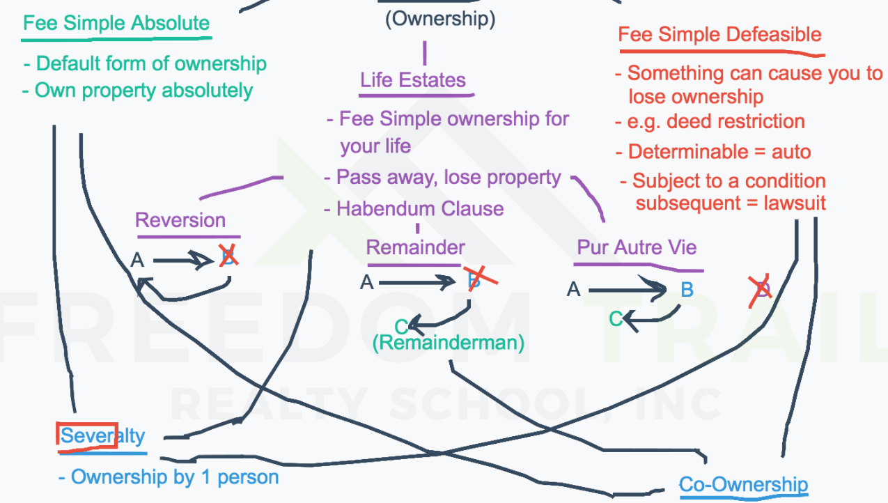

## Severalty

**1 person**

A freehold interest (ownership) held by only one person. Its root is "severed"; ownership in severalty is the ownership of real estate severed from any co-owners.

## Co-ownership (should review) 

#### 1. Tenancy in Common

* default
* Inheritable 

#### 2. Joint Tenancy

**Must：**

* *unity of time* Acquire ownership at same time
* *unity of title* In the same deed
* *unity of possession* All have equal right of possession
* *unity of interest* All have equal interests 
* Specify joint  ownership

**Survivorship**

* Last person standing
* Not inheritable

#### 3. Tenancy by the Entirety

* Joint tenancy for married couples
* Creditor protections
  * auto homestead
  * forced sale for debts of one spouse only
* On divorce, automatically become a tenancy in common

#### 4. Condominium

Joint ownership of common areas, and fee simple ownership of units

* Master Deed (condo building)
* Unit deed
* Condo Association
  * Declaration of **Trust**
  * Bylaws(内部章程) of the Association
* Condo Fees
  * Super-priority lien
  * run with land
  * 6D certificate (what‘s going on the fee)
  * special assessment

#### 4. Cooperatives

* Cooperative(LLC) owns the building

* The people living in the building own stock or shares in the company (or stock certificates)
* The cooperative will have a co-op board like a condominium board of trustees, and owners will pay monthly co-op fees
  for building expenses, similar to condo fees. Banks will typically accept stock in a cooperative as collateral for a loan.

#### 5. Timeshares

* Basically condos for time, rather than space, in the property
* Owner pays maintenance fees
* Also known as interval ownership, a prepaid vacation, or a floating use period.

## Securities 

* shares in companies, debt(bonds), etc.
* RE license doesn't let you broker these

1. Syndications

   * Corporation that invests in 1 or more pieces of RE
   * investors receive returns base on performance of those properties

2. REIT

   Publicly traded portfolio of properties

3. REMIC

   * Trust that holds mortgage
   * Pays investors on the performance of the mortgages

## Non-Freeholds

Basically, rentals

- Leasehold = written conveyance of possession with a fixed timeframe (e.g. a 12 month lease)
- Tenancy at Will = verbal permission that either party may terminate

> In Massachusetts, lessor or lessee must give 30 day notice to vacate in order to terminate a tenancy at will.

- Periodic Tenancy = automatically renews on some pre-agreed interval until terminated (e.g. month to moth)
- Tenancy at Sufferance = holdover tenancy without landlord permission 
  - landlord must evict

> Remember, the terms estate, tenancy, and interest can be used interchangeably

# Class 0405 

# Property Right Limitations 1

Page. 18

## Government Limitations

### P.E.T.E

#### 1. Police power

* the right of government to regulate private activity if it's in public interest to do so.
* Zoning = governs land use
  * e.g. use(residential, commercial, etc), height, setbacks, visual appearance, lot sizes, parking, open space, density, FARs, etc
  * 3 ways around zoning: 
    1. **on-conforming use**: A legal use that existed prior to the enactment of current zoning ordinances
    2. **variance**: Special permission to do something otherwise forbidden by the zoning rules
    3. **conditional use permits**: Think of this as a limited variance. Conditional use permits (CUPs)
       allow a commercial or residential use
* Building codes = govern how you build
  * Building codes define basic requirements for construction without necessarily prescribing implementation
  * Certificate of Occupancy (C/O) = proves that the property was built up to code and is safe for occupancy

#### 2. Eminent Domain (土地征用权)

* Right of government to force the sale of privately owned property 

#### 3. Taxes

**municipal property taxes**

* Taxes assessed against your property by the town or city (municipality)

* Pay for most of the things the town or city does

* Taxes run with land

  * Towns can foreclose for unpaid taxes
  * Superpriority lien
  * Equitable right of redemption= 1 year from the date of sale

* Taxes are charged on the assessed value of your property

* Taxes are charged in mills ($1 per $1,000)

* Paid quarterly or semi-annually on a fiscal year running from July 1 to June 30th (8/1, 11/1, 2/1, 5/1 in MA)

  Special Assessments = charges for improvements made to your property by the town 

  > e.g. sewer hookup, or street lighting ("betterments")

* Special Districts = tax districts that charge adjacent homeowners for services they receive

*Math: Property taxes*

>What is the annual property tax on a $100,000 home that is assessed at 40% of its value in a town with a millage rate of $20 per 1000?

$100,000 * 0.4 = $40,000 assessed value

$40,000 / $1,000 = 40 payments * $20 = $800 tax bill

> What is annual property tax on a $250,000 home assessed at 50% with a mileage rate of $15 per $1,000

$250,000 * 0.5 = $125,000 assessed value

$125,000 / $1,000 = 125 payments * $15 = $1,875

#### 4. Escheat (充公)

* reversionary interest in all privately owned property held by the state

## Private Limitations

Private limitations or restrictions (also known as CC&Rs) are contractual limitations on ownership created by deed or separate agreement. There are two basic kinds:

1. Covenants = contractual limitations in a subdivision
   * Must be uniformly applied to all the owners
2. Deed restrictions = contractual limitations written into your deed (receipt)
   *  Violation of a restriction can result in a lose of title

## Conflicts Between Public and Private Limitations

If there is ever a conflict between private restrictions and public zoning, the more restrictive rule wins. So, if a private restriction limits homeowners to 2.5 story buildings, but public zoning allows up to 3 stories, the homeowner would
be limited to 2.5 stories. 

## Environmental Limitations (p.20)

##### Comprehensive Environmental Response, Compensation, and Liability Act of 1980 (CERCLA)

Superfund Act.

##### Leaking Underground Storage Tank Program (LUST)

Underground Storage Tank program

##### MA Oil and Hazardous Material Release Prevention and Response Act (Chapter 21E)

##### The Clean Water Act of 1972 (CWA) 

Regulates pollution of navigable (and connected) waters. 

[Cuyahoga River Fire](http://www.ohiohistorycentral.org/w/Cuyahoga_River_Fire)

##### National Flood Insurance Program (NFIP)

Requires property owners in "high risk flood zones" (think: waterfront property) to purchase flood insurance if their community participates in the NFIP and if they have a federally backed mortgage.

[Flood Money](https://www.npr.org/sections/money/2017/09/29/554603161/episode-797-flood-money)

##### Massachusetts Wetlands Protection Act 

The act requires a buffer zone (an area where you cannot build anything) of 100 feet from any wetlands. The DEP or local conservation commission may permit certain minor changes after **50 feet**, and may also permit certain changes within the buffer zone, subject to DEP regulations, though typically no changes may be made to the wetland itself.

[MA Wetland and Wetland Change Areas Map](http://maps.massgis.state.ma.us/images/dep/omv/wetviewer.htm)

##### Coastal Zone Management Act (CZMA)

A federal law designed to protect coastal zones (like the Gulf of Mexico or
Long Island Sound) from the harmful effects of real estate development. It limits, or completely eliminates, development in those zones.

##### LEED Certification

### Environmental Vocabulary

* Accretion – An increase of property by the gradual, natural action of **wind or water** (e.g. the slow increase of a beach).
* Aeolian Soil – Soil deposited by **wind**, such as sand dunes or silt.
* Alluvion – An increase of land area along a shore by **deposited alluvium** or by the **recession of water** (e.g. the slow increase of a riverbank).
* Alluvium – Any clay, silt, sand, gravel, or similar detrital material (sand, rocks, gravel, etc.) deposited by running water.
* Avulsion – The sudden separation of land from one property or its attachment to another, usually caused by flooding, a storm, or a change in the course of a river.
* Erosion – The process by which the surface of the earth is gradually worn away by natural actions (e.g. water, wind,etc.).
* Reliction – An increase of the land by the **sudden retreat** of the sea, lake, river, or other body of **water** (e.g. a sudden decrease in the water table).

## Other Property Right Concerns (p.22)

#### Easements

* Rights of way across another's property
* "Run with the land"
* Easements appurtenant = 2 adjacent lots of land
  * 4 ways to create:
    1. Deed
    2. Implication
    3. Necessity
    4. Prescription
* Easements in gross = personal held easements

#### Licenses

Personal, revocable and non-assignable permission to enter someone else's property for a particular purpose (e.g. ticket holders in sporting events).

#### Encroachments

The intrusion of an improvement onto a neighboring property (e.g. a misaligned fence). Failure to take action against an encroachment may result in a loss of the land (again via O.N.C.H.A. with a 20-year time frame).

## Financial Limitations (Liens)

* General Lien = covers ALL property (Personal + Real)
* Specific Lien = covers just one piece of property (usually real estate)

#### Voluntary Liens

* Mortgage = lien for the purposes of securing a real estate loan
  * Mortgagor = borrower, mortgagee = bank
* Installment Sales Contracts = agree to make payments for property. and don't legal title until you make your final payment
  * Equitable title = a future right to acquire legal title

#### Involuntary Liens

* Property Tax Liens = lien for unpaid property taxes
* Federal Tax liens = general liens for delinquent federal taxs
  * Estate Tax liens = liens against an estate for unpaid taxes
* Mechanic's Lien = a protection for contractors against non-payment
* Judgments = final decision by a court, can result a sheriff's sale
* Attachments = legal seizure of property to satisfy a possible judgment 
  * Lis Pendens = recorded notice of the attachment

# Class 06 

# Transfer of Property Part 1

Study guide p.49

## Transfer of Property

* How is real estate transferred?
  * Conveyed with a Deed
* What are deeds?
  * Legal document that transfers title, or ownership - like a receipt
* What is the difference between a deed and title
  * the deed is physical document, where "title" is a **concept**. Concept of ownership
* Who are the parties involved in a title transfer
  * Grantor ("or" give):  typically, a seller (or owner)
  * Grantee("ee" accept): typically, a buyer 

## Title

- Title = ownership  (the concept of ownership)

  > **Alienation** – loss of ownership; 
  >
  > * can be voluntary, such as in a real estate sale 
  > * or involuntary, such as in a foreclosure

- A property owner can lose title
  - Involuntary Alienation
    - Forced loss of ownership (Foreclosure or Tax sale)
  - Voluntary Alienation
    - Willing loss of ownership

## Deed

#### Purpose of a Deed: 

document that transfers title - ownership

#### Deeds Essentials:

* Must be in writing
* Grantor must be legally competent
* Signature of the **grantor**
* Must name Grantee
* Involve the exchange of of *consideration* 
* Include a full legal description of land
* Include a granting clause
* Delivery and acceptance 

> Grantee signature is not required.
>
> Date is not required

## Recordation

* What is recordation?
  * Act of making title transfer public record at county registry of deeds
  * Provides constructive notice = public notice
    * As compared to actual notice = told something specifically 
* Recordation is recommended, but **NOT required** 

## Land Description & Surveys

* Full legal land description (one of the essentials of a valid )

#### Land Survey Measurements

You might see a number of units of measurement used in the survey. They are:

1 link: 7.92 inches (call it 8 inches for memorization)
1 foot: 12 inches
1 yard: 3 feet
1 rod: **16 feet 6 inches**
1 chain: 66 feet
1 furlong: 660 feet
1 mile: **5,280 feet**
1 acre: 43,560 square feet (1 chain x 1 furlong)
1 square mile: 640 acres  (5280^2=27,878,400/43,560=640)

#### Metes and Bounds

* Metes and Bounds Survey (used in the original 13 colonies)
  * Most common land description
  * Point of beginning and the ending are always the same
  * Lot lines or boundaries of the property are always description

An example metes and bounds survey might read:

> "A plot of land located in Boston, Suffolk County, Massachusetts, beginning at the intersection of Canal and Causeway
> Street, running south along Canal Street 304 feet, West to Friend Street 150 feet more or less, North to the intersection of
> Causeway Street and Friend Street, then East along Causeway Street to the intersection of Canal and Causeway Street."

#### Lot and Block

Plat maps are another method of surveying land. They are the recorded plans for a subdivision or municipality, and use the lot and block method. The lot and block method divides the property by streets into blocks, and then subdivides those blocks into lots using the metes and bounds method for each individual lot. The total area of the parcel of land is also described using a metes and bounds survey. 

An example Lot and Block survey might read:

> "Lot 43, Block 17, Green Acre Homes in the City of Portland, according to the plat thereof, recording in Volume 6 of plats, page 84, in Multnomah County, Oregon."

#### Government Rectangular Survey System

- Squares created by the intersecting of tiers and range lines = townships
- Townships are 6 miles x 6 miles
  - Contains 36 square miles (23,040 acres) 

* Townships = divided into 36 **sections**

  * Sections = 1 mile x 1 mile  (**640 acres**)
  * Numbered 1-36
  * Northeastern Corner always #1
  * 16th section = school section

  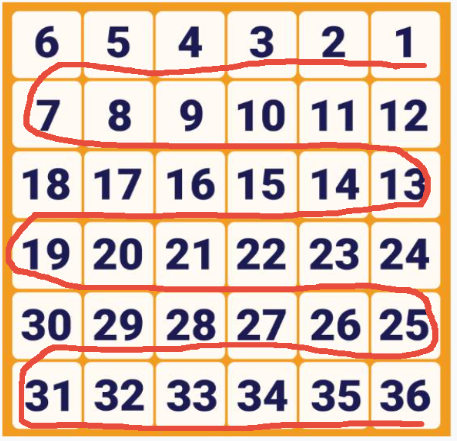

* Section are divided into

  1. Halves of 320 acres
  2. Quarters of 160 acres
  3. Further subdivided into quarters and halves

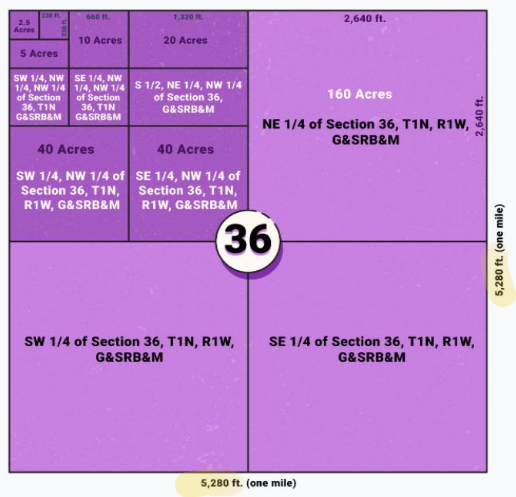

* Sizes for each area in a Government Rectangular Survey 
  * Quadrangle/Check: 24 miles by 24 miles, 576 square miles, or 368,640 acres
  * Township: 6 miles by 6 miles, 36 square miles, or 23,040 acres
  * Section: 1 mile by 1 mile, 1 square mile, or 640 acres
  * Half-Section: 1 mile by ½ mile, ½ square mile, or 320 acres
  * Quarter Section: ½ mile by ½ mile, ¼ square mile, or 160 acres
  * ½ of a Quarter Section: ½ mile by ¼ mile, 1/8 square mile, or 80 acres
  * ¼ of a Quarter Section: ¼ by ¼ miles, 1/16 square mile, or 40 acres

## Types of Deeds

#### General Warranty Deed

= warranty Deeds

* Grantor accepts all liability and offers extended warranties

#### Special Warranty Deed(limited warranty deed)

* Grantor is only liable for any title claims that originated during the ownership
* Grantor promises they did not cause any title issues

#### Bargain and Sale Deed (court)

* Grantor states they have a right to convey ownership, even if they do not own the ownership

#### Quitclaim Deeds = Non warranty Deed

* Grantor offers no warranties and is not liable for any claims against title
* Grantor conveys only the interest he/she has at the time of transfer
* Most commonly seen in bank foreclosures or to correct a mistake in public record

> In MA - This is the same as a special warranty deed, with title insurance

#### Deeds of Trust or Trust Deed (not tested)

#### Reconveyance Deeds

* Trustees will often use this type of deed
* Used to return property to trustors

#### Trustee's Deeds

* Executed by a trustee to transfer real estate to anyone who isn't the trustor

#### Deeds executed pursuant to a court order

* Issued as a result of the order in a will or a court

# Class 07 

# Transfer of Property Part 2

study guide p.50

## Timeline of Property Transfer

1. Property is listed, then put under agreement via the signing of the P&S
2. Lender hires an attorney or title company to conduct a title search
   * Title search = examination of the chain of title
   * If there are any clouds on title, seller mist fix before closing

3. Seller provides a deed to the buyer transferring ownership of the property
4. Buyers gives the lender a note as evidence of their debt and a mortgage to secure the debt
5. Last minute title search to verify nothing has changed
6. When closing is complete all documents are recorded at the registry of deeds along with the municipal lien certificate

* After recording, seller's attorney pays the listing brokerage
* Listing brokerage pays the buyer's agent's brokerage
* Any recorded documents are duplicated and digitized to provide a public record of transfer
  * Available in MA at www.masslandrecords.com
  * 

## MA Recording Stamps

Massachusetts Recording Stamps

* Also known as documentary, excise, revenue, transfer or conveyance stamps
* Transfer fee
* Expense paid by the grantor
* Do not implant

#### Math

A property sold for $505,100, how much stamps?

1. Round up $505,100 -> 505,500

2. How many stamps need to pay?
   * $505,500/500=1011$

3. How much ? 
   * $1011*2.28=2305.08$
   * 

## Title Insurance

* Title insurance = insurance policy that protects against undiscoverable title defects
* Doesn't cover ownership issues that could be discovered via public record or any private or public property right restrictions
* Lender require a lender's policy (paid by borrower) = Mortgagee protection
* Borrower/Homeowner can get their own policy = Mortgagor Protection
  * Standard Coverage 
  * Extended Coverage

## Land Court

* The Torrens System (provides certainty of title to land)
  * Deals with conflicts about property ownership
  * Action to Quite Title
  * Performs title search and then holds hearings to determine who is the rightful owner of the property 
  * Once decision is made, it issues a Certificate of Title
    * Certificate of Title registers land = **this overrides all prior documents**

* Registered Land
  * Transfer must be recorded
  * Transfer not valid

## Other Title Transfer Methods

#### Wills

* How property of the deceased in transferred
  * Intestate: die without a will
  * Testate: die with a will

#### 

* If the deceased passed testate (with will)
  * Executor is named and carries out last wished
  * The executor devises (transfers) real property to the devisees (heirs receiving real property), and bequeaths (transfers) the personal property (the bequest or legacy) to the legatees (heirs receiving personal property).
* If the deceased passes intestate, (without will)
  * Admin is appointed by court
  * Laws of descent and distribution will govern who receives the property
* If deceased passed intestate and without heirs, (no will, no heirs)
  * Escheat
* Codicils = amendments to wills 
* Holographic = handwritten wills
* Nuncupative will = verbal wills
  * Not enforceable in most states
* Property owned with others in a will is known as =
  * Et ux: with wife
  * Et con: with husband
  * Et al: with others

#### Adverse Possession

* Legal term for squatters rights
* O.N.C.H.A (open, notorious, continuous, hostile and adverts use)
* 20 years+
* Doesn't apply to public or registered land

#### Dedication 

> Private person donates land usually for a public use

* Donation of property rights
* Can be permanent or temporary

# Class 08 

# Contracts

p.31 1/25/2021

## Contracts

What is contracts?

* legally binding agreements between two or more parties
* Performance: doing what you promised

## Essentials of contracts and Statues

**Valid**: has all 4 essentials legally binding

**Voidable**: missing reality of consent & competence 

* Move forward or
* Go to a judge and ask to void it

**Void**: missing #1 #2 #3 not legally binding

#### 1. Offer & Acceptance (meeting of the minds)

- Shown by signatures or action electronic signatures are binding

- Real Estate contracts must be in writing per Statute of Frauds 

#### 2. Consideration

* Valuable Consideration 

#### 3. Legal Object

* Contract to do something illegal is NOT a contract

#### 4. Reality of Consent and Competence

1. Freedom from:
   * Misrepresentation
   * Fraud
   * Duress
   * Undue
2. Parties must be:
   * Sober
   * Of sound mind
   * Of legal age

##### Unenforceable: 

can't be enforced if the court deems it to be unfair or impossible

##### Doctrine of the Laches

* lose your rights if you fail to assert them within a reasonable time frame
* can be used to render a contact unenforceable

##### Statute(法规) of Limitations

* Hard legal limit as to when you can assert you can bring a claim to court
* Can be used to render a contract unenforceable after that time limit has passed

## Unilateral vs Bilateral

| Unilateral (One way)                      | Bilateral                                 |
| ----------------------------------------- | ----------------------------------------- |
| One party making promises to another      | two parties making promises to each other |
| ex. option listing contract reward poster | ex. fixed term lease P&S agreement        |

## Contracts (cont.)

#### Assignment

* Transfer of a party's rights and obligations to another party
* Assignor: person giving the rights(person assigning contract)
* Assignee: person receiving the rights
* Contracts can be assigned

#### Breach of Contract

* What is a breach? 
  * broken term
* When there's a breach (violation) of contract, here's what can happen:
  * **Rescission** -cancellation of contract
  * **Specific performance** - court order forcing party in violation to comply w/ terms type of injunctive relief (court order act)
  * Damages -$$monetary compensation for harm suffered as a result of breach
  * Liquidated Damages -$$pre agrees upon amount of money in the  event of breach
    * Forfeiture - loss of deposit that was made during creation of contract

#### Common Clauses in Contracts

* Ironclad Merger Clauses (Integration Clause, Merger Clause, Entire Agreement Clause)
  * Any other agreement outside the written contract won't have any effect
* Severability Clause
  * Any part of the contract that is illegal will be voided, but the rest will remain in effect
  * Severs the voidable part
* Contingency Clause
  * Makes the contract contingent/RELY ON on something happening (e.g. the buyer receiving financing)
    * If it does not happen, the contract is typically voided

## Quiz:

##### The Doctrine of Privity has to do with:

C. The right to sue under a contract

Explanation: The doctrine of privity has to do with who may be given rights and obligations under a contract (only those who are parties to the contract), and who therefore may be sued.

# Class 09 

# Contracts in Practice 

Page 33 (1/12/2021)

### Outline

* Listing Contracts
* Buyer Agency Contracts
* Offers
* Purchase and Sale Contracts
* Options
* Rights of First Refusal

## Listing(Selling ) Contract

About employment

####  1. Listing Contract (Broker Employment Contracts)

* Used to hire a real estate agent to sell a home
* Always **negotiable**
* Include: What property the broker is selling, what commission they will be paid, the broker's authority and deadline for the sale

#### 2. Entry Only Listing ("Data Entry Only")

* Seller pays a flat fee to put the property on MLS
* Broker offers Limited services to the seller
* Typically, Seller shows their own home and negotiates their own

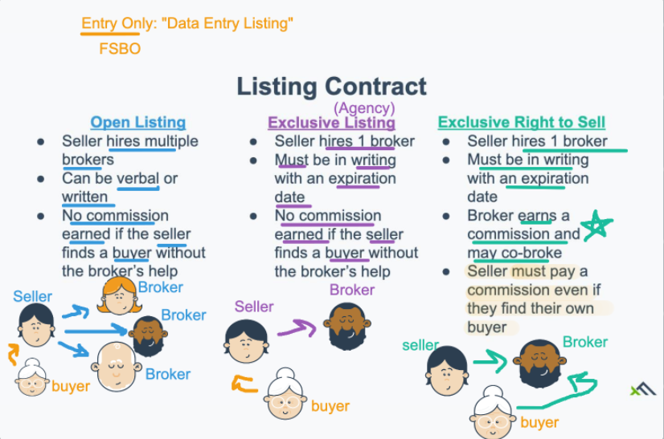

#### 3. Open Listing

* Seller hires multiple brokers
* Can be verbal or written
* No commission earned if the seller finds a buyer without the broker's help

(For sale by owner)

#### 4. Exclusive Agency

* Seller hires **1 broker**
* Must be in **writing** with an expiration date
* No commission earned if the seller finds a buyer without the broker's help

(Co broke)

#### 5. Exclusive Right to Sell (Most common)

* Seller hires **1 broker**
* Must be in **writing** with an expiration date
* Broker earns a commission and may co-broke
* Seller must pay a commission even if they find  a buyer

## Buyer's Agency Contracts

* Buyer's agency contracts cover exclusivity, but not always commission or payment
  * (most times, buyer's agents are paid by the seller as a co-broke
* Note: on the exam real estate commissions are treated as a cost for the seller
  * But buyers can pay commissions directly to their agent
  * (you could have a min commission in this agreement. If the seller compensation is less than the min, the buyer would make up the difference )

## Offers

* What is the purpose of an offer?
  * To reach an acceptable agreement between buyer and seller, so that the agreement is signed with the intention to move forward
* Offeror: give the offer (buyer, typically)
* Offeree: Seller, typically

> In a counter offer, those roles change

* An offer leads to the signing of a Purchase and Sale Contract (P&S)
  * (memorialized the offer, is the final contract that leads to the sale)
* Verbal offers or acceptance are non binding per __Statute of Frauds__ (All RE contracts must be in writing to be enforceable)
  * All offers must be presented
* Aside from acceptance , offers may be terminated by any of the following: 
  * At end of time limit stated in the offer
  * Death of either party to the offer
  * Destruction of object of offer
  * Withdrawal of offer before it has been accepted in writing
  * Counter-offer
* **Agency relationships** have no effect on the offer
* Binder or letter of intent in some transactions can serve as an offer
  * (very common in new construction)

## Purchase and Sale(P&S) Contracts

* Agreement about how a sale will take place

Page 34

## Options

* Written contract where the owner of piece of property grants another party the right to purchase or lease the property
* Consideration exchanged 
* Certain time frame at pre-agreed terms (At end of the lease, you can purchase the property for 400k )
* What type of contract is an option?
* ....

## Other Real Estate Contracts

* Right of First Refusal
  * A right of first refusal gives a prospective buyer the right to match any offers made on a property
  * right doesn't give the buyer control over what price or terms the property sells for
  * allow the seller to track the market and ensure fair market value
* Right of First Offer (page 35)
  * Prospective buyer is offered the "first right" to purchase a property
* Power of Attorney
  * Written document giving the *right to act as a proxy*(they can do things just like they are you) for another 
  * Creates attorney-in-fact

# Class 10 

# Leases 

page.43 

## Lease

* Leases are a non-freehold interest in real estate

  > non-freehold -> possession & use 

* Synonyms for lease

  Rental, Leasehold, Tenancy for Years, Estate for Years, Interest in Years, Demise, Non-Freehold

* What are leases?

  * Written conveyance of possession and use of real estate for some specific period of time

  * **Privity of Estate**: legal relationship between two parties interested in the same property

  * Subject to the Essentials of contract

    > Covered in greater detail in contracts

    1. Offer & Acceptance
    2. Consideration ($$)
    3. Legal Object
    4. Reality of Consent & competence

* Essentials of a Lease
  * Sufficient description of premises -address
  * Rental Amount - how much/when payment is made
  * Terms of Lease - dates
  * Intention to Rent (Mary Intents to rent to Joe)
* Parties in lease
  * Lessor: Landlord       Lessee: Tenant
* Leases longer than **7 years** must be recorded in MA
* Leases can't last more than **99 years**

* Lessor is liable for and insures common areas (entry lobby, common laundry, parking)
* Lessee is liable for and insures leased premises (rental unit)

* Commercial Leases
  * Usable Square Footage: Space that the lessee can occupy and is responsible
  * Rentable Square Footage: Both the leased premises and a percentage of the common areas used by lessee, but maintained by the lessor
* Lessor retains reversionary interest under the lease
  * tenants who stay past their lease are tenants at sufferance
* **Leases run with the land**
  * Certificate of no defense/Estoppel Certificate
* Why does the Doctrine of Estoppel Exist
  * Goal: prevent the tenant from trying to renegotiate or defraud new property owner

## Transfer of a Lease

1. Sublet - Transfer a portion of one's interest in a property to a 3rd party

2. Assign - transfer all remaining interest to a 3rd party

3. Novate - cancellation of the lease, 3rd party signs a new lease with the lessor

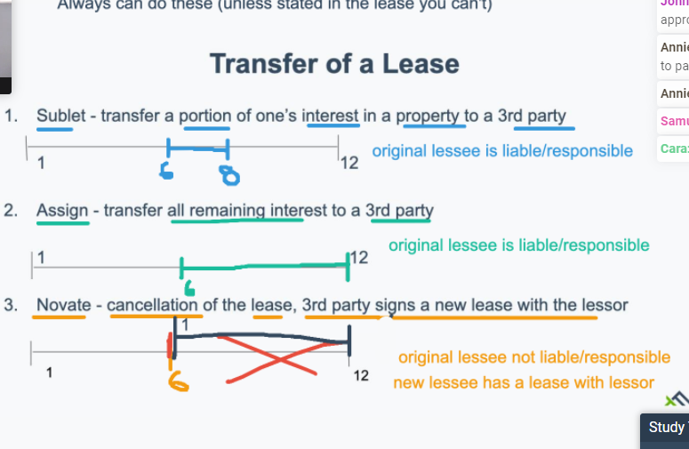

## Lease Termination

Aside from Novation, a lease can be terminated in a variety of ways:

1. Performance - Lease automatically terminates at end of term
2. Surrender - cancellation of lease prior to expiration
3. Action of Law - eminent domain taking, tax sale, bankruptcy
4. Destruction - property is destroyed 
5. Foreclosure - banks have right to cancel the lease
   * Under Protecting Tenants at Foreclosure Act of 2009: res. leases can survive unless the buyer at foreclosure is going to use it as their primary 

#### Continue

##### Actual Eviction

* Lease has been breached by the tenant
* For non payment of rent
  * Next steps for lessor

1. 14 days notice to quit in writing
2. Unlawful detainer complaint (summons)
3. Housing Court - Hearing Held
4. Eviction
   * must use constable to remove tenant and their belongings from property

##### Constructive Eviction

* Permits Lessee to vacate premises and ends obligation to pay rent due to lessor's violation of the covenant of Quite Enjoyment

Covenant of Quiet Enjoyment

* Undisturbed enjoyment of leased property
* Property is maintained up to sanitary and building ocdes
* Lessor doesn't lease to others
* Lessor doesn't threaten expulsion
* Lessor doesn't trespass
* Service promised in the lease are provided. 

## MA Landlord Regulations

* Lessor can only collect:
  * FMR 1st month's rent
  * LMR
  * Security Deposit of Max of 1 month's rent (escrow account)
  * Reasonable lock and key fee
* If a security deposit is collected, lease must include:
  * Statement of Condition Form (tenants returns with 15 days of the lease start)
  * Security Deposit Receipt (form)
  * Notice of where security deposit is being held (form)
* Lessor must pay lessee 5% interest or current bank rates on security deposit and last mouth's rent each year
  * Interest must be paid within 30 days of annual tenancy each year

## MA Landlord Regulations

* Lessor must provide housing that is fit and suitable for occupancy per sanitary codes
  * Inspected prior to occupancy
  * De-lead, < 6 years
  * Pay for head/hot water/water unless lease requires lessee to pay
  * Provide Kitchen with

## Property Management

* Property Managers are Special Agents or General Agents
* Act in best interest of the property owner
* Compensation typically based on percentage of gross effective rental income

## Types of Leases

* Gross Leases (almost all residential leases) 
  * Lessee pay fixed rent, lessor pays operating expenses of the  building
  * Lessor receives gross income
* Sublease/Sandwich Lease
  * Lease between original tenant and subletter
* Modified Gross Lease
  * Tenant pays fixed rent year one
  * If lessor expense increase, lessee will pay a percentage of this increase
* Net Lease
  * Tenant pays rent and some or all of the **property's operating expenses**( 
    * 1. Maintenance 2. Property taxes 3. Property insurance
    * Single Net, Double Net, Triple Net
  * Lessor receives net income

* Percentage Lease (department store)
  * Most of the rent is paid as a percentage of the lessee's gross receipts or sales
  * Helps align landlord and anchor tenant's interest
  * Most often seen with *department stores* (tjmaxx, Xmas tree shop)
* Ground Lease (McDonalds)
  * Lessee rents the land and may build whatever they want on it
  * When lease expires, any improvement are owned by the lessor
  * Typically 99 years
  * Most commonly use by fast food chains (McDonalds)
* Graduated Lease
  * Rent increases on some pre-agreed upon schedule
  * Escalator clause increase or decreases rent
  * Best for **entrepreneurs** or those who need lower expenses at the beginning of their lease term
* Index Lease
  * tent is tied to some index (consumer price index)
* Reappraisal lease
  * rent based on appraiser's opinion of rent
  * Common when doubt about future main
* Sale-leaselack

# Class 11 

# Property Valuation Part 1

p.25

## What is a value?

What is value

Value is how much a ready, willing, and able buyer will pay for something, and a willing and informed seller will accept.

* Who determines value

  Buyer

* What is the difference between an appraisal and a CMA/BPO

  * Appraiser will estimate the value of the property and write an appraisal
  * Real estate agents can estimate the value of property through a comparative market analysis or broker price opinion

#### Real Estate Agents & Value

CMA – Comparative (or competitive) Market Analysis; used to determine listing price; typically based on price per square foot; a broker or their subagent’s opinion of real estate’s value based on evaluating data of comparative properties; also known as BPO

#### Elements of Value (D.U.S.T.)

* **D**emand – The number of people that want to buy the property (and are actually able to do so).
* **U**tility – Something’s **usefulness**. The more useful it is, the more demand there is.
* **S**upply (or Scarcity) – How many are there? The more plentiful something is, the less it is worth (and vice versa).
* **T**ransferability – Sellable real estate must be free from clouds on title (issues with ownership). This is known as having good and clear title or marketable title. Real estate with title defects is difficult to sell, and thus has lower value.
  * e.g. Lien

#### Types of Real Estate Value

- Market Value – The theoretical price a ready, willing, and able buyer would pay, and a willing, informed seller would accept in an arms-length transaction (a sale with no collusion between the buyer and seller). Also known as fair market value.
- Market Price – The actual amount paid in the market.
- Value-in-Use – The value to a particular user of a property (e.g. farm value vs. raw real estate value).
- Cost – The total **cost to build** a property.
- Investment Value – The value of a property for investors.
  - CLUE： Comprehensive loss underwriting exchange
- Insurable Value – The value of a property for insurance. The Comprehensive Loss Underwriting Exchange (CLUE) records past consumer claims that are used in homeowner's insurance underwriting.
- Assessed Value – The tax value of a property.
- Liquidation Value – The foreclosure value of a property.

### The Principle of Value

* Change:  Real estate values change
* Anticipation: Expected benefit of real estate ownership
  * function of change
* Substitution: Buyer will not pay more for something than what is costs for a comparable good (neighboring values influence a buyer's opinion of value)
* Progression/Regression:  Increase/decrease of property value due to substitution
  * Appreciation: Increase of value
  * Depreciation: Decrease of value
* Four Stage life cycle

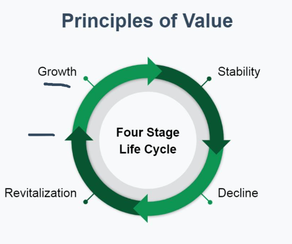

* Balance: Value is created/maintained when there is a balance of different types of real estate (i.e. balance between commercial property and residential property)
* Conformity: Maximum value is achieved when properties are similar
* Contribution: Additional Investment in real estate (typically provides increase in value)
* Increasing/Decreasing Returns: Spending money to improve a property may not equate to an increase in value
  * Over improvement: Too much spent
  * Under improvement:  Too little spent
* Competition: Profit attracts competition
  * Competition leads to supply, which leads to a decrease in value
* Consistent Use: Value of land can't be based on a higher speculative use
* Highest and Best Use: Most optimal use

### Influences on Property Value

Basic forces that influence the value of real estate

* Social Trends
  * Open floor plan
  * Mudroom
* Economic
  * If the economy is doing well then values are up
* Government and legal
  * Taxes, zoning and building

* Environmental and Physical
  * Location, location, location! Think: proximity to transportation and  highways, natural resources, climate, views, etc.
  * location to amenities, major roads, etc

### Depreciation

* Depreciation = loss in value due to aging of a property

  * Accrued Depreciation = already occurred when property purchased

  ...

#### Types of Depreciation

Loss of value can occur due to any of the following:

* Physical Deterioration
  * **Aging**, wear and tear, or neglect of the building
  * Curable
* Functional Obsolescence
  * Poor/Outdated designed or change in building standards
  * Curable
* Economic Obsolescence
  * External factors have a negative impact
  * Incurable

# Class 12 

# Property Valuation Part 2 (need review)

#### empty

## Capitalization Rate

* Another way to value investment property
* Capitalization Rate(Cap Rate) = the percentage of the property value that an investor expects to receive as NOI every year
  * More reliable than GRM
  
  * Investors usually have a goal cap rate
  
  * Formula: $Cap Rate=NOI/Sales price$
  
    > **Net income** – also known as net operating income (NOI), it is the effective gross income minus operating expenses

#### Capitalization Rate Math

Formula: NOI/Sales Price = Cap Rate

## Cash on Cash Return

* Most popular investment value options for investors
* Most on Cash Return = return on investor's cash investment
  * Helps investors determine how their real estate is performing
  * Percentage of total investment received as annual cash flow (before taxes)
  * Formula: Cash Flow before taxes/ Dollars Invested= Cash on Cash return
* Ideally, investors want cash on cash return to be higher  than cap rate
* Cash flow after taxes will change anytime a debt service payment is made

#### Cash on Cash Return Math

Formula: Cash Flow/Dollars Invested = Cash on Cash return 

## Cost Approach

* Cost Approach = using the cost of construction to estimate value
  * Used for unique properties with no comps or income
  * e.g. a church or brand new construction

#### Math

Example of final real estate value using cost approach

$520,000 Estimated replacement/reproduction cost

-$60,000 Less depreciation costs

___

$460,000 Estimated improved value of property

+$92,000 Land value (calculated using sales comparison approach)

---

$552,000 Final estimated real estate value

## Cost Approach

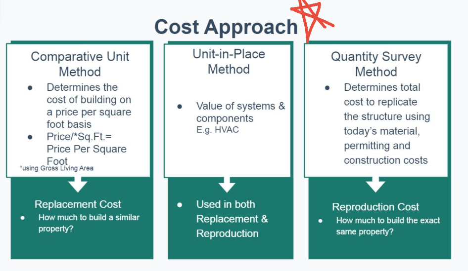

#### Math

* Example of Final 

# Class 13 Introduction to Financing

p.69

## Introduction to Financing

#### What is financing?

Receiving, or providing, money the the purchase of real estate 

#### Key terms

* Note: Evidence of the debt - promissory note
* Mortgage: secures the debts - you give this to the lender
* Collateral: The property

#### Parties involved in a financing arrangement

* Mortgagor: Borrower, or buyer
* Mortgagee: Lender 

## Financing Steps

1. Buyer applies to a lender for a loan

   * Usually done before they start looking
   * Have been pre-approval? Have you gone through the pre-approval process?

2. Lender uses gross salary, credit history, and debt to income ratio to assess a buyer's ability to pay for the loan

   * Income, stability and source of income, net worth, credit

   > DTI - % of debt, compared to your total income

3. Buyer receives a pre-approval or pre-qualification letter

   * Pre-qualification - Collect into from you, but don't validate everything
   * Pre-approval - Validate the info

4. Buyer finds a property to purchase

5. After P&S is signed, the lender hires an appraiser to determine if collateral（抵押品） for the loan is sufficient to cover the loan in the event of a default

6. Lender's attorney conducts a title  search to determine

7. dada

8. At closing, the lender creates the loan for the buyer and in return, the borrower gives a note as evidence of the debt, along with the mortgage, securing the debt

9. Over the term of the loan, the borrowers pays back the loan. Upon repayment, the mortgage discharges and the borrower/homeowner now owns the home free and clear.

*if the borrower defaults on the terms of the load, the lender can foreclose on the 

## Foreclosure

#### What is foreclosure?

A legal process, where the lender attempts to recover the balance of a loan from a borrower in default, by forcing a sale.

* Judicial Foreclosure: Court supervised, and initiated by a lawsuit
* Non-Judicial Foreclosure: follows a process - "power of sale" clause in a mortgage allows for this

Foreclosures are usually done by public auction

* Bank grants title to the highest bidder by signing and delivering new deed to the new owner (could be the bank itself)

After foreclosure, depending on the sale price, the borrower will either receive or own money to the bank

* If the proceeds from the sale are in excess of the borrower's debt plus lender's expense = borrower will receive their leftover equality
* If the proceeds from the sale are short and don't cover the debt plus lender's expenses = borrow is personal liable 

If the highest bidder was the bank itself = the bank owns the property and will sell it on the open market

* SEO

#### Preventing Foreclosure

Equity Right of Redemption

* Homeowner can buy back their home if before the auction they can repay the lander that is owed plus the costs of foreclosure

Short sale

* Homeowner sells their home "short" of what they own to the bank
* Bank settles for less money and writes off the loss
* Typically occurs when homeowner owes more that that the home is worth
* Bank agrees to take whatever price they can get on the open market
  * Must approve the sale price
  * Can take 6 months +

## The Notes and the Mortgage

Clauses in the Note

* Acceleration Clause: permits the lender to accelerate the maturity date of the loan if there is a default on the terms of the mortgage
  * Calling in the note: 1st step in foreclosure
* Prepayment Penalty Clause: requires the borrower to pay a penalty for prepaying the loan
  * Used to guarantee that the lender gets paid entire interest on the loan (common in commercial)

Mortgage: provides piece of property as collateral for the loan

* Lien, not the loan
* Borrower hypothecates their property - give up the security interest, but retains possession

So who holds title?

**Lien Theory State** (FL NY ME RI):

* borrower holds legal title of a property that is financed

**Title Theory State** (MA):

* a state where the bank holds legal title to mortgaged property, and the borrower holds equitable title

## Mortgage (p.67)

* Mortgage  Covenants: borrower's promises
* Power of Sale Clause: allows lender to take the property and sell it if the borrower defaults on the terms of the loan
* Defeasance Clause: automatically relives the collateral of the bank claim when the loan is paid bank
* Due on Sale Clause: entire payment

> **Due on sale clause** – also known as alienation or assumption clause; permits lender to accelerate maturity date of the loan in the event of a title transfer; prevents transfer of mortgage to a third party

* Garn-St. Germain Act: Due on sale clause can't triggered on death, devising property, leasing, marriage, divorce or transfer to a family trust
* Subordination Clause: 

## Points

Points: use to increase the value of the loan

* 1 point = 1% of the loan amount
* If the interest rate is so low that the lender won't make much money, they can charge points to borrower as an origination fee in order to increase profits
* Discount Point: can be paid up front by the borrower

> Points only paid on the **loan amount**	

## Mortgage Broker vs Bankers

Mortgage Broker

* 3rd parties
* Don't originate (make) loans
* Offer a variety of loan products from different investors/banks
* Broker charges a fee
* Can be great for tricky loan situations

Mortgage Bankers

* Work directly for the bank
* Originate loans
* Offer products only from their bank
* No broker fee

# Class 14 

# Real Estate Financing

Study guide p.69   Feb 23

## Outline

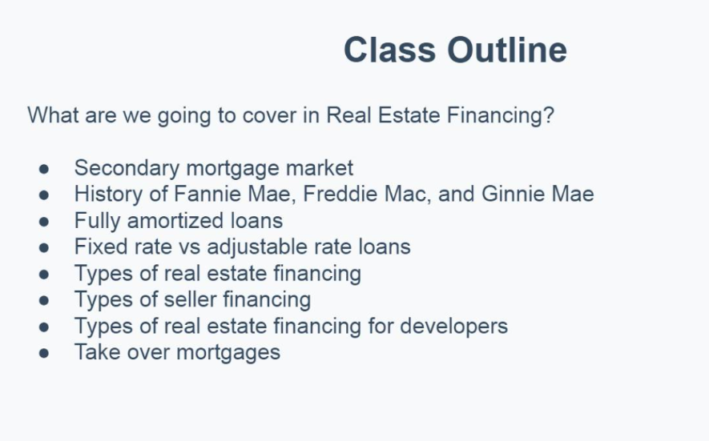

## Real Estate Financing 

* When a buyer receives financing for a home, the money doesn't always come from the same bank where they applied for the mortgage
  * Portfolio loans = loans that a bank keeps & services in house
* Secondary Mortgage Market
  * Where banks sell loans to  investors
* Mortgagor forwards future mortgage payment to new owner
  * Mortgagor doesn't need to consent to the sale of their loan
  * Helping Families Save Their Homes Act
  * Certificate of no defense/Estoppel Certificate

* Who Brought the Secondary Mortgage Market

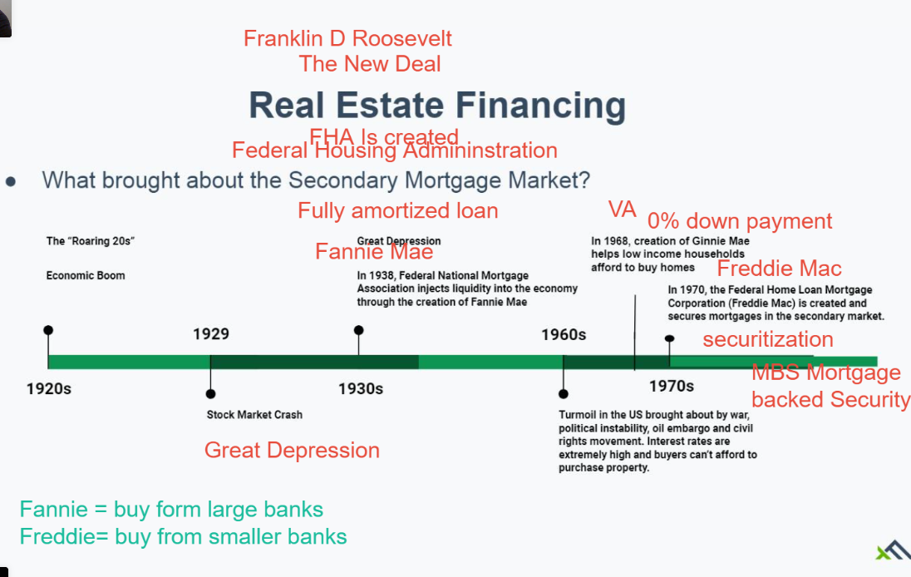

## Fully Amortized Loans

* Fully Amortized Loans Vocabulary
  * Amortization = payment of debt in equal payments
  * Debt service = PRincipal and Interest
  * Principal = amount borrowed (debt) or loan amount 

* Fully Amortized Loans = loans that are completely paid off when last payment is made
  * Also know as **Direct Reduction Loans**
  * Debt service pays both principal & interest
* PITI Payment
  * Principal
  * Interest
  * Taxes
  * Insurance (home owners insurance)

* How to fully amortized loans work?
  * Every mouth the same payment is made but the amount going towards principal and interest will change and at the last payment the loan is paid off in full
* Amount going toward principal & interest changes over the life of the loan
  * Recalculated monthly
  * Only **12 days** in a calendar year for calculation

* Principal payments are always residual
  * Difference between total payment & interest due
* With each payment made, amount of money going toward principal increases, while the amount going toward interest decreases
  * Final payoff = discharge

## Math using the amortization table

Formula = (loan/1000)* PI = monthly payment

* Fully Amortized Math

  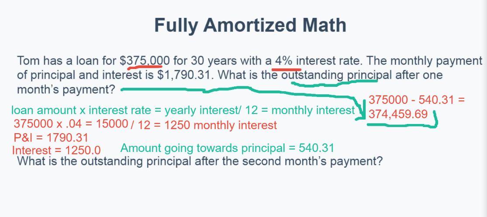

Second month payment 

$374,459.69*0.04 = 14978.39/12 = 1248.20$ (interest)

P&I=1790.31

Interest=1248.20

Amount to principal = 542.11

* Practice time

373,917.57*0.04=14956.70/12=1246.39

Amount to principal = 1790.31-1246.39=543.92

Answer: $373,917.57-543.92=373,373.65$ 

## Fixed vs Adjusted 

* A loan can be either fixed rate or adjustable rate
* Fixed Rate
  * Interest rate doesn't change over the life of the loan
* Adjustable Rate
  * Interest rate is usually lower in the beginning
    * Teaser or discounted rate
  * Interest rate adjusts based on prime rate(e.g. prime + 2pts)
  * Payment caps
    * If increase is higher than cap, bank will carry it over to next rate increase

## Types of Real Estate Financing

* Balloon Loans
  * Amortization period is longer than pay period
  * Balloon = unpaid principal at the end of the term

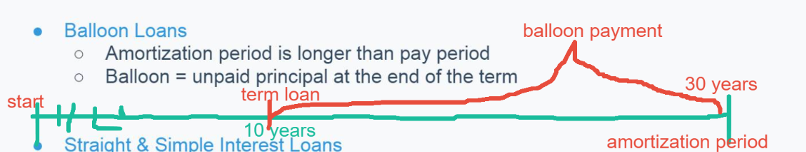

* Straight & Simple Interest Loans
  * Interest only loans
  * Non compounding debt calculated daily
  * Principal paid in one lump sum at the end of term

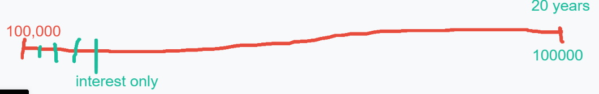

* Second Mortgages = Junior Liens

  * HELOC, Equity Line, Line of Credit， Open End Mortgage
  * Borrower is given line of credit against their equity

* Graduated payment loans (Dr.)

  * Monthly payment is lower in the beginning & increases as the homeowner makes more money
  * Used for homebuyers with **predictably rising incomes** (e.g. doctors)
  * Negative amortization of interest

* Growing Equity Mortgage

  * Extra payments are made toward the principal
  * Homeowner will pay off loan faster

  *predetermined schedule of payments*

* Reverse Annuity Mortgage 

  * Bank makes payments to the borrower (homeowner) against the equity in their home
  * Must be **62 years** old to use
  * Loan plus interest must be repaid when home is sold or homeowner passes

  *Typically within 12 months of person dying*

## Types of Seller Financing for Real Estate

* Purchase Money Mortgage = Seller Financing

  * Seller = Mortgagee, Borrower = Mortgagor

  *Seller acts as bank or lender*

  *Buyer gives the seller a Note and a Mortgage*

* Wraparound Mortgage (Seller Financing)

  * Seller "wraps" their existing debt around the borrower new loan
  * Helps seller pay off their existing debt while making extra money from seller financing arrangement 
  * Seller keep the loan in place with current lender

  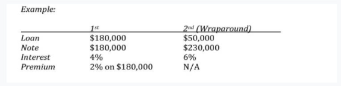

  Seller makes 2% on 180K, 6% on 50K

* Construction Loans

  * Borrower receives funds in draws
  * Loan typically get replaced once construction is complete

* Package Mortgage

  * Covers real and personal property (real and equipment)

* Chattel Mortgage

  * Secured by personal property only

* Blanket Mortgage

  * Used for development of subdivisions where there are multiple lots
  * includes Partial Release Clause
    *  A partial release clause would allow the developer to pay off part of the mortgage whenever an individual home was sold.

* Non-Recourse Loan

  * Borrower not personally liable for on loan deficiency after foreclusure
  * Only the property is the security for the loan

* Bridge Loans or Swing Loans

  * Short term loans

  * bridge the borrower over some gap in cash flow

    > e.g. a shortfall in construction between stages of a project

  * Swing loans are a type of bridge loan that allow a homebuyer to borrow against a new home they're purchasing to carry two mortgages while they sell their old home

* Participation Mortgage

  * Lender participates as an equity partner in a development 

* Shared Appreciation Mortgage

  * Investor makes a down payment for a buyer in exchange for share in property equity

* Buy Down

* Take over Mortgage  (seller cannot have a due on sale clause)

  * Subletting of the mortgage
  * Buyer takes over seller's debt & original loan stays in place
  * Buyer would pay seller their equity & receive a deed along with right to redeem title after paying off loan
  * FHA loans that originated prior to 1989

  There are three methods of taking over the seller's lien:

  * Subject to – Only the original mortgagor is legally responsible for the loan, and is liable if there is a deficiency after a foreclosure auction. Best for the buyer.
  * Assumption of – Both the original mortgagor and new owner are responsible for the loan, and any potential deficiency. The buyer and seller are jointly responsible.
  * Novation – The seller's note is cancelled, and a new note is written between the lender and the new buyer. Only the buyer is responsible for the debt; the seller is released from their obligations. Best for the seller.

  

jane@rightkeymortgage.com

# Class 15 

# Government Financing Programs

Study Guide p.74

## Outline

* FHA
* VA
* USDA
* PMI

## Government Financing Program

* Government has a few programs in place to assist homeowners with purchasing a home
* Encourage banks to make attainable loans for homebuyers

## FHA (Federal Housing Administration 1934)

#### National Housing Act of 1934

* Introduced fully amortized loans and low down payments
* Created FHA
  * Part of the New Deal (during the depression)
  * Why? To encourage home ownership by making home loans more affordable and accessible to buyers
* Doesn't loan money

#### How does FHA work

* Remember, the FHA only insures the loan (and charges the borrower for the insurance); they do not make the loan.

#### What is LTV

* Loan to Value 
* Amount borrowed expressed as a % of sales price
* FHA allows up to 96.5% LTV (must put down 3.5%)

#### FHA

* FHA will insure the "riskiest" part of the loan in the  event of foreclosure

  * The bank is willing to lending to the buyer bc of the protection

* Buyers pays for the insurance as part of their monthly payment

  * Knowns as mortgage insurance (MI)

  * > MI - Comes from the government

* Monthly MI payments remain for the life of the loan

  * Can never be removed
  * Homeowner would need to refinance to get out of MI

* Types of FHA loans

  * 203(b): 1-4 family
  * 234(c): Condo
  * 203(k): Rehab

* Loan Limits and Cap on Purchase Price

  * Vary by State/County

* Primary Residence only

  * Occupied for the majority of the year
  * Can establish residency after 1 year under FHA guidelines

* Benefits of FHA loans

  * Low down payment: 3.5%
  * Easier to qualify (allow higher DTI (Debt to income, lower FICO scores, etc)
  * Competitive interest rates
  * No prepayment penelties

* Who is eligible?

  * Anyone purchasing a property as their **primary residence**

    * > Not a first time home buyer

* FHA approval process is *similar to conventional*

  * Based on buyer's income, credit, down payment money and appraisal 
  * Additional property approval element of inspection (min Health and safe) 

* FHA loans that were originated prior to 1989 are assumable (An **assumable** mortgage allows a buyer to take over the seller's mortgage. )

  * No due on sale clause
  * No longer relevant for practice as of 2019, but still on the exam.

* REMEMBER:

  * FHA insures loan, NOT make loans
  * FHA doesn't set interest rates.

## VA (Veterans Affairs Financing)

#### Veterans Affairs Financing

* Established in 1944 as part of the Gl Bill

* Similar to FHA except there **isn't a down payment required**

* There is a funding fee (can be rolled into the loan)

* Who is it for? Honorably discharged veterans

* Benefits:

  * No down payment
  * Low or no FICO score
  * No mortgage insurance premium

  > VA Appraisal - Similar to FHA, in that includes safety and security issues

## USDA Financing

#### The United States Department of Agriculture (USDA)

* Loans, grants, and other financial programs for low/middle-income Americans in **rural** areas who want to purchase a home or farm land
  * Also provides money for home renovations in rural areas in order to bring them up to current building and zoning code
* USDA offers 0% down payment in some circumstance
  * Note: The exam tests that only VA loans offer the 0%
* USDA multi-family housing program
  * Rental housing loans
  * Offers affordable rental housing to very low, low and moderate income households
    * Additional programs for elderly housing and those with disabilities

## PMI (Private Mortgage Insurance)

#### Private Mortgage Insurance

* Insurance for lender is provided by a **private** insurer

* Buyers can put down less than 20%

* Who pays for PMI? (buyer or borrower)

* Can you remove PMI? 

  > Yes! Automatically removed when you reach 78% LTV
  >
  > 80% by request, Most commonly, through refinancing

  PMI can be shopped by the lender. If credit is better, PMI is lower.

* *Remember: PMI is insurance provided by a private insurance company, whereas MI is insurance provided by the government*

##### Under the Dodd Frank Act's new TRID rules, the HUD-1 was replaced with:  The Closing Statement

# Class16 

# Government Financing Regulations (后半节课)

Government Financint 

## Government Financing and Regulations

* Real estate sales must be reported to IRS by the lender, along with the 

## Investment Taxes

* Depreciation
  * Loss given to you by the IRS
  * Calculated on economic life of the property
    * Residential: 27.5
    * Commercial: 39
  * Can only be deducted from retail income or passive income
  * Only those who qualify as real estate professionals may deduct depreciation from active income (750hrs)
  * Only improvements can be depreciated 
    * The land and the improvements to the land
* What happens when an investment property is sold? 
  * Capital gains tax
  * Depreciation recapture

#### Example: Investment Taxes

After 39 years, owner sells for $220,000

* Profits: $220,000-100,000=$
* 

## 1031 Like Kind Exchanges

1031 Like Kind Exchange

* Way to defer payment of capital gains tax
  * Defer: transfer to a later date (not eliminate)
* Must reinvest the proceeds from the sale into another piece of real estate
* Must happen within 6 months of the sale
* Unreplaced property value or reduced mortgage debt (“**boot**”) is taxable

## Residential Taxes

* Residential homeowners may write off mortgage interest and property taxes

  * Up to $750,000 of mortgage debt
  * Up to $10,000/yr in property taxes, including any state tax write offs

* Who can take advantage of the deduction?

  * Must be a primary residence

* Taxpayer Relief Act of 1997

  * Portion of profit on primary residence is sheltered from capital gains tax
    * Single: $250,000
    * Married: $500,000

  > You must have lived in the property for 2 of the last 5 years

# Class 17 

# Consumer Protection Laws

## Outline

* MGL Chapter 93A
* Home inspections
* Hazardous materials
* Lead paint guidelines for sales vs rentals
* Smoke detector and carbon monoxide regulations
* Construction Warranties

## Consumer Protection Act

* MA general law chapter 93A - consumer protection act
  * Enacted in 1967, then amended in 1969 to allow for private right of action

* Examples of what might get someone into trouble with MGL C93A

  * Consumer is not fully informed of product or misled
  * bus does not unhold its return policy 
  * bus does not meet its warranty agreement
  * false ad

* Guidelines to file under MGL Chapter 93A

  * Matter must involve a business/licensee
  * One must have suffered monetary damages (or could have)
  * Complaining party must write 30 day demand letter

* What's in a **30 day demand letter**?

  * What happened
  * What the damage
  * send it to offending bus

* Whether or not you meant to deceive someone doesn't matter

  * No intent standard

  > No caveat emptor (let the buyer beware)

* Penalties

  * Min= double damages
  * Max= Treble(3) damages + court costs + attorney fees

* Exceptions

  * if business makes a reasonable offer that is rejected by consumer, court may limit damages to settlement offer

## Home Inspection 

* What is a home inspection?

home inspection is the buyers opportunity to inspect the property with a licensed home inspector

* Are they required?

No

* Who can recommended a home inspector?

  * Buyer agent
  * Seller agent may NOT but can provide the consumer fact will list of inspectors
  * Dual agent may NOT either

* Buyer must be given a MA home inspection brochure when P&S is signed

  * All MA consumer fact sheet can be found:
    * https://www.mass.gov/lists/consumer-fact-sheets

  

## Hazardous Materials

* A 21E Certificate (see the Property Right Limitations section on Environmental Limitations) is used in Massachusetts to certify that real property is free of contamination. 

  > 21E certificates are most often used for commercial properties, but may also be used for residential real estate. Hazards may also be tested for if the seller agrees to the testing.

* Brownfields = lands that have been previously used for commercial

* Greenfields=land have not been contaminated

* MA DEP

  * Provides liability relief & financial incentives 

* **Title V** – requires septic system to pass inspection within 2 years prior to sale (or 3 years if pumped every year) or 6 months after sale
  *  A Board of Health member, with proper training, may inspect a septic system under Title V.
  * When a septic system fails its Title V inspection, as long as it is disclosed, the buyer and seller negotiate who will bring it into compliance. The seller can take care of it before the sale and then the Title V certificate will be obtained by closing, or the buyer can choose to take care of it as long as it is brought into compliance within 6 months after the sale. In this second case, the Title V certificate would be obtained after the closing.

#### Lead Paint

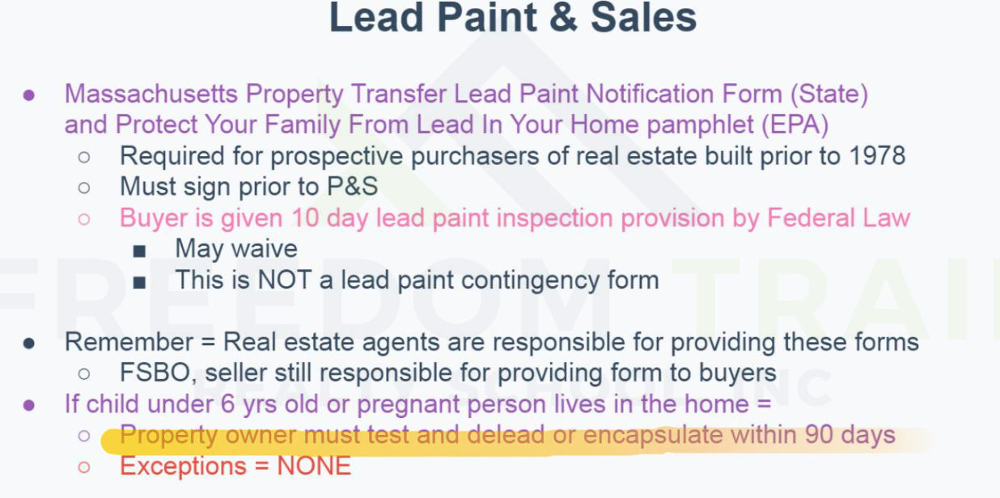

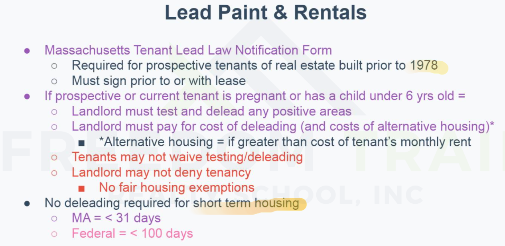

#### Smoke detectors

* Prior 1975 require smoke detector certificate signed by local fire chief

* | X-1975        | 1975-1997      | 1997-Now                    |
  | ------------- | -------------- | --------------------------- |
  | battery power | interconnected | interconnected with battery |

* In MA, as of December 2016, all battery operate detectors must be 10yr+ photoelectric sealed 

#### Carbon Monoxide 

* As of Mar 31st 2006, MA homes must have carbon monoxide detectors if 
  * The home has fuel-burning equipment that produces carbon monoxide
  * Indoor parking is adjacent to the living areas of the home
  * CarbonMonoxide detectors installed on every level. The law applies to ALL homes, not just those that are being sold. 
  * New home construction or renovations must have hard wired detectors; older homes may be brought into compliance with battery-operated detectors.

## Construction warranties

# Class 18  

# Real Estate Agency 

p.57 Jan 26

## Parties to an Agency Agreement

#### Principal = person hiring an agent

#### Agent = person hired tc

* Universal Agent: may represent the principal on any matter 

  > The best example here is a CEO of a business who has been given full board approval to make any decisions for any aspect of the business (hiring, investing, purchasing, product development, etc.).

* General Agent: may represent the principal on matters related to one business or activity

* Special Agent: may represent the principal on a specific matter or transaction

* Subagent = the agent's agent: represents the principal on the behalf of the agent

  * e.g. Salesperson: work indirectly for the principal (client) of the transaction via special agent 

## Parties in Real Estate Agency

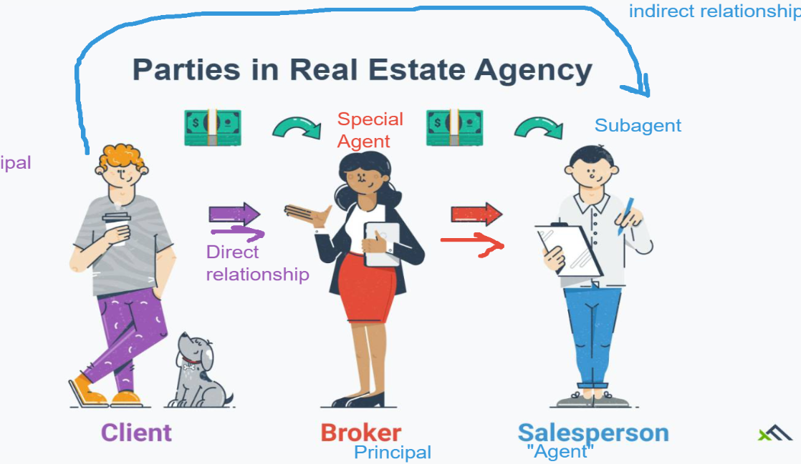

Broker receives client money directly, then pays the agent

## Three Types of Agency

* Express Agency
  * Explicitly stated verbally or in writing (e.g. via a listing contract).
* Implied Agency
  * Authority that exists because of the principal and agent's actions, even though it is never directly stated
  * Never Directly stated
* Apparent/Ostensible Agency
  * Authority Does NOT exist even through it appears to

## Fiduciary obligations (obligations of trust)

O.L.D. C.A.R.

1. **O**bedience: must do what client asks so long as it is legal
2. **L**oyalty: must put client's best interest first, even ahead of your own
3. **D**isclosure: must disclose what you know
4. **C**onfidentiality: Must not disclose any confidential information
5. **A**ccount: must account for/return any money that belongs to principal
6. **R**easonable Care: Must protect principal, exercise competence & care, not operate outside scope of expertise

* Client = people you represent and must give OLDCAR
* Customer = people who may work with you, but you do not represent them so you don't need to provide OLDCAR

> In MA - Agency will need to be disclosed using Mandatory Licensee-Consumer Relationship Disclosure form

> Dual agency needs to be disclosed &  agreed upon by the client(s) involved

## Confidentiality and Required Disclosure

| Must Disclose                                                | Must Not Disclose (confidential)                             |
| ------------------------------------------------------------ | ------------------------------------------------------------ |
| Material Defects  (Anything that would impact a buyer's decision to purchase a property/real estate) | Anything that won't materially impact the property or ability to conduct transaction e.g. How low the seller can accept |

* When something might have to be disclosed
* Can differ deepening on the state law
* **Might have to disclose**(Stigmatized properties)
  * Any property that was a site of deaths, murders, suicides, criminal activity, any paranormal activity

* Megan's Law & Sex Offender Registry
  * Each state handles disclosure of sex offenders differently
  * In MA, it is strictly forbidden to misuse or misrepresent the contents on the registry (**NEVER Represent the contents on the registry**)
  * Direct clients to the registry so they can do the research for the  themselves

# Class 19  

# Real Estate Agency in Practice

p.57 Feb 1

### Skipped some part

## Commissions Math 

(net + cost)/(1-% of commissions)

## Advertising Regulations

* FTC Do Not Call
  * Unsolicited business calls to residential number on the registry and mobile number
  * Fines up to $**40,654** per call
  * Exceptions
    * If you call a For Sale by Owner listing

* Telephone Consumer Protect Act (TCPA) and the Junk Fax Prevention Act
  * Both prohibit unsolicited fax advertisements

* CAN-SPAM
  * the address of the sender
  * "opting out" of future messages.
* The Children's Online Privacy Protection Act (COPPA)
* Interstate Land Sales Disclosure Act

#### Sherman Anti-Trust Act

* Passed in 1890
* Purpose: To stop anti-competitive business practices
* **Preventing**  the following:
  * Price Fixing
    * Establish a uniform price
  * Geographic Division of Markets
    * An individual office would control a certain area
  * Group Boycotting
    * they all decide to not buy from a certain business
  * Contingent Sales (trying or tie-in arrangements)
    * A future transaction is tied to the current transaction
* Violation: 
  * 2+ people agree to act and 
  * The agree upon act restricts trade (limits competition)
* Penalties
  * Corporations
  * Individual

# Class 20 

# Introduction to Fair Housing

Feb 18 Study P.62

## Fair Housing Law Basics

* What is the purpose of fair housing law?
  * to ensure equal opportunity 

## Why is fair housing law important?

* Shelter is a basic necessity
* Housing is a major contributor to wealth and education
  * Primary residence = single largest contributor to most households' net worth
  * School funding = primarily determined by local property taxes
* **Discrimination was historically prevalent and permitted**

* US Federal loan programs (FHA, VA) officially denied and limited lending in non-white communities 
* Housing developments law
* Next slides are excerpts from the 1936 edition of the Federal Housing Admin Underwriting Manual
* 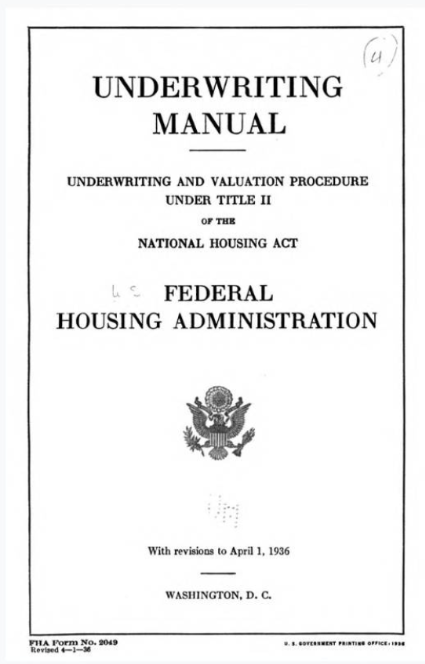

* **Many types of discrimination are now illegal, but are still prevalent** 

* A 2019 undercover investigation of real estate agents on Long island found that they:
  * Discriminated against
    * 19% of Asian clients
    * 39% of Hispanic clients
    * 49% of black clients
  * Directed white and non-white clients to different neighborhoods 24% of the time ("steering")
  * Provided white clients with 50% more listings on average than black clients

* A 2017 Suffolk Law study found that transgender and gender non-conforming renters were discriminated against 61% 
* The fair Housing Center of Greater Boston found that:
  * Families with children were discriminated against 33%
* A 2020 joint study by The Boston Foundation, Suffolk Law, and The Analysis Group found that in the Greater Boston area:
  * 71

* The impacts of this historical and present day discrimination are significant
* Example: median net worth in Boston (2017)

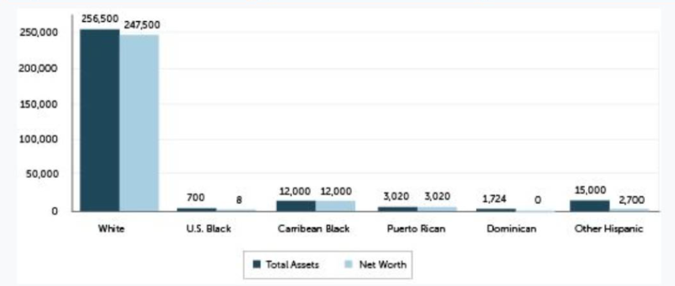

## Federal Fair Housing Laws

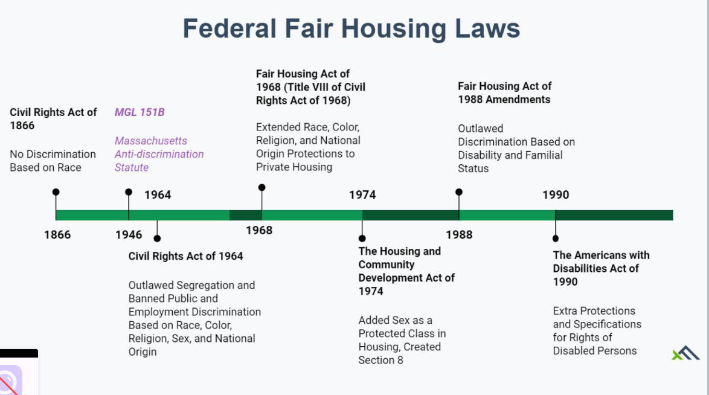

## Quiz:

1. Fair housing outlaws discrimination based on: (Protected Classes)

> Fair housing law outlaws discrimination on the basis of certain protected classes (groups of people).

2. The Massachusetts fair housing law is: (MGL 151B)

# Class 21 

# Fair Housing Law

feb 18

## Federally Protected Class

Under the Fair Housing Act and Amendments, the federally protected classes are:

* Race 
* Color
* National Origin
* Religion
* Sex (male/female)
* Familial Status
* Disability

## ADA (Americans with Disabilities Act)

* After March 31 1991, all new or renovated residential 4+ unit house must have accessible design features for 1st floor and any floors serviced by an elevator
* Reasonable mod of residential rentals must be permitted by the landloard
  * can be at the tenant's expense
  * can be required to be returned to original condition upon move-out
* Commercial properties built or renovated after 1991 must be accessible
  * Businesses open to or that serve the public = public accomodations
  * Both landlord ....

### Service and Support Animals

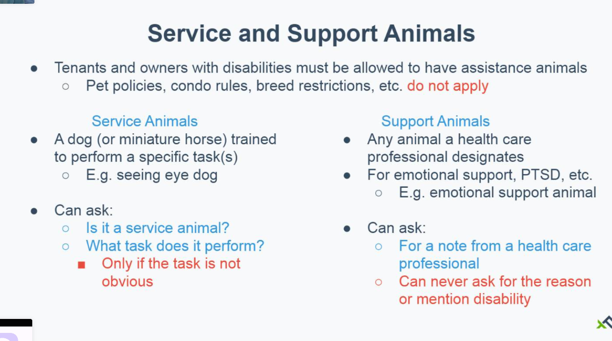

#### Service Animals

* Trained to perform a specific task(s)
* Can ask:
  * Is it a service animal?
  * What tasks does it perform? (*Only if the task is not OBVIOUS*)

#### Support Animals

* **Any animal** a health care professional designates
* For emotional support, PTSD, etc.
  * E.g. emotional support animal

* Can ask:
  * For a note from a health care professional
  * Can never ask for the reason or mention disability

## MA Fair Housing Law

* MGL 151B  
  * Org passed (1946)
  * Covers more than just real estate
* MA protected class are 
  *  race, 
  *  color, 
  *  sex, 
  *  national origin, 
  *  religion, 
  *  disabilities, 
  *  familial status, 
  *  age, 
  *  marital status, 
  *  sexual orientation, 
  *  public assistance status, 
  *  gender identity, 
  *  veteran status, 
  *  genetic information, and 
  *  ancestry.

## Public Assistance Program

* Public Assistance = receiving housing or other government assistance
  * Discrimination based use of public use of public assistance is illegal in MA
* MassHousing
  * Provides financing for affordable housing
  * Oversees affordable housing developments
  * Provides low down payment load options for first time home buyers
* Section 8
  * Federal program that provides housing assistance
  * Voucher system that subsidizes rentals with private

## Exemption to FHL

* Exemptions are never allowed based on race (Federal & MA)
* Exemptions are never allowed based on public assistance statue (MA only)
* Advertising is never exempt from fair housing law
* Licensed real estate agents must **always follow fair housing laws**
  * No exemptions are ever permitted for real estate agents
  * People who hire a real estate agent may not use any exemption

#### Federal Exemptions

* Private individual who owns <= 3 single family homes (can't have sold more than 1 in the last 24 months)
* Rentals in owner-occupied 2-4 family homes
* Federally approved housing developments for seniors or retirees are exempt from familial status under Housing for Older Persons Act of 1995
  * 100% occupancy of 62+ years old residents
  * 80% occupancy of 55+ years old residents

#### MA State exemptions

* No exemptions for single family home owners
* Rentals in owner-occupied 2 family homes only
* State approved housing developments for the senior or retirees are exempt from familial status and age under Housing for Older Persons Act of 1995
  * Same % occupancy requirements as federal

## Exemptions to Fair Housing Law

Both Federal and State exemptions include: 

* Religious organizations that offer housing to their members 
  * Must be for non-commercial purposes

## Quiz

1. If a client arrives to an appointment to view apartments and brings their dog wearing a service animal vest with them, what should the real estate agent do? (nothing)

> Explanation: In order to avoid a fair housing violation, if someone brings a dog that is obviously a service animal, such as one wearing a service animal vest, you should never ask if it's a service animal.

2. Katie is the owner of a 3 family property in Boston, MA that was built in 1930. She wants to rent our her first floor aparment and since she lives on the 3rd floor of her home, she would have the Fair Housing exception to do what? (nothing)

> The owner-occupied fair housing law exception only applies to 2 family properties in Massachusetts. Katie would not be able to utilize any of the exceptions if she owns a 3 family.

# Class 22 

# Fair Housing in Practice

## Federally Protected Classes

Quick review: **Federally protected classes**

* Race 
* Color
* National Origin
* Religion
* Sex (male/female)
* Familial Status
* Disability

## MA Fair Housing Law

MA Protected classes

*  **race,**
*  **color,** 
*  **sex,** 
*  **national origin,** 
*  **religion,** 
*  **disabilities,** 
*  **familial status,** 
*  age, 
*  marital status, 
*  sexual orientation, 
*  public assistance status, 
*  gender identity, 
*  veteran status
*  genetic information
*  ancestry.

## Differentiation on Terms or Conditions

Cannot impose different or additional requirements on someone based on a protected class

## Discriminatory Advertising

* Illegal to specify preferences or limitations based on a protected class
  * e.g. "empty-nesters" (familial status), "immigrant community" (national origin), or "no drinkers" (disability; alcohol addiction)
* illegal to target or exclude protected classes
  * e.g. HUD lawsuit Facebook for real estate ad targeting

* Covers ALL advertising, not just print, TV, and ratio
  * Includes MLS postings, online listings, social media, websites, etc

## Advertising Best Practices

Best practices from the National Fair Housing Alliance:

* Focus on the property, not an ideal renter or people in the area
* **Do not state a preference for or exclude certain groups of people**
* Include the fair housing logo and /or equal housing opportunity tagline
* Do not exclude protected classes using ad targeting
  * Advertising in a foreign language is legal, so long as the advertisement contents comply with fair housing laws
* If an adver

## Falsifying Availability

* Most often lying about a property being unavailable to avoid working with a member of a protected class
  * e.g. saying that a property has already been rented to unlawfully avoid renting to a tenant using section 8
* In MA, records of property availability must be kept for 3 years after advertisement

## Blockbusting

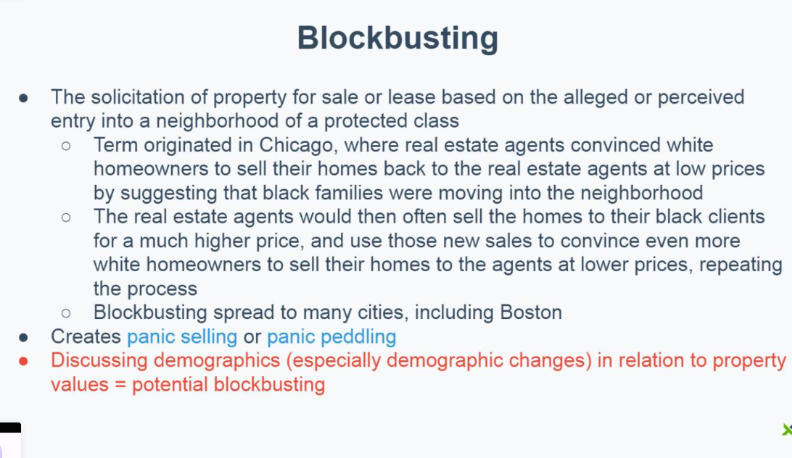

which is any solicitation of property for sale or lease on the grounds of an alleged change in property values due to the presence or prospective entry into a neighborhood of people covered by a protected class. It creates panic-selling (also known as panic peddling)

## Steering

* Directing someone toward, or away from, neighborhoods based on a protected class
  * E.g. only showing Hispanic clients properties in Hispanic-majority neighborhoods
* **Do not make assumption about where your clients want to live**
* **Do not limit the listings or areas you share with your clients if they meet your clients' specifications**
* **Do no provide your clients with demographic information**
* **Avoid opining about neighborhood safety**
* **Avoid opining about school districts**
  * Do not discuss school demographics

## Restrictive Covenants

* Shelley vs Kraemer
  * Supreme Court casein 1948 that made racially restrictive CC&Rs illegal
  * Refresher: CC&Rs = covenants, conditions and restrictions

## Professional Organizations

* Realtors, MLS, local professional groups, etc. Cannot limit membership based on a protected class

## Fair Housing Posters

* A **HUD Equal Housing Opportunity Poser** must be posted in every real estate office

* An **MCAD fair Housing Law Poster** must be posted in every real estate office

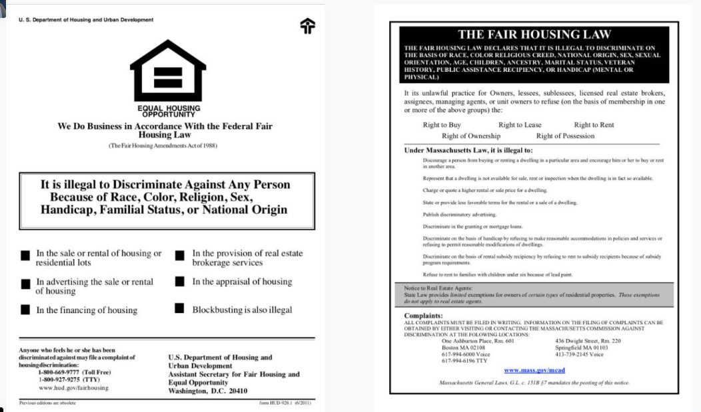

## Penalties and Violations

* Any person may file a complaint with the **Department of Housing and Urban** Development (HUD)
  * Within 1 year of the alleged date of discrimination
  * Testing is permitted  (HUD/MCAD/Private Groups)
* A HUD **Administrative Law Judge** (ALJ) can fine:
  * 1st  offence: up to **$16,000**
  * 2nd up to **$37,500**
  * 3rd up to **$65,000**
  * Additional **civil penalties** between **$50,000 - 100,000**
    * No specific limit on damages
    * Potential criminal penalties if a federal lawsuit is filed within 2 years
* *Massachusetts Commission Against Discrimination (MCAD)* findings against an agent result in an **automatic license suspension** for:
* 1st offense: **minimum of 60 days**
* 2nd offense in 2 years: **minimum of 90 days** 

## Best Practices

* Treat all of your clients and customers the same
* Create checklists and standards of service for everyone to avoid discrimination made through implicit bias
* Add the **HUD Equal Opportunity Housing Logo** to your email signature
* Talk about properties, not people
* **Do not make assumptions**
* **Always follow the law**

## Quiz

* Sasha tells her real estate agent, Jamie that it's important for her to live in a neighborhood with lots of other families so that her daughter can make friends easily. She's also looking to spend up to $600,000 for a relatively renovated home that has at least 2 bedrooms and 2 bathrooms and a level backyard. Jamie gives Sasha a **list of 5 towns** that would best meet her and her daughter's needs and when Sasha narrows down the list of towns to just 3, Jamie sends her all of the available properties that meet her criteria. Has the real estate agent risked their license?
  * Yes because the agent has engaged in steering

> Cannot give list of town based on protected class

# Class 24 

# The Massachusetts Real Estate Test

## Test Topics - General

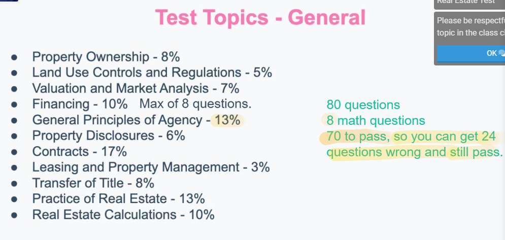

## Test Topics - State

* Duties and Powers of the Board - 5%
* Licensing Requirements - 10%
* Requirements Gornvering 

##  Requirements to Take the Exam

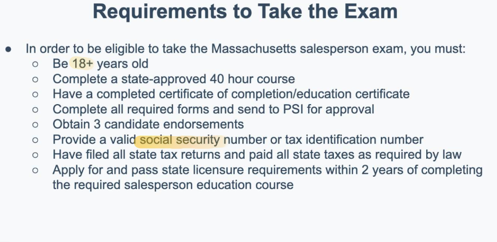

## Application Process

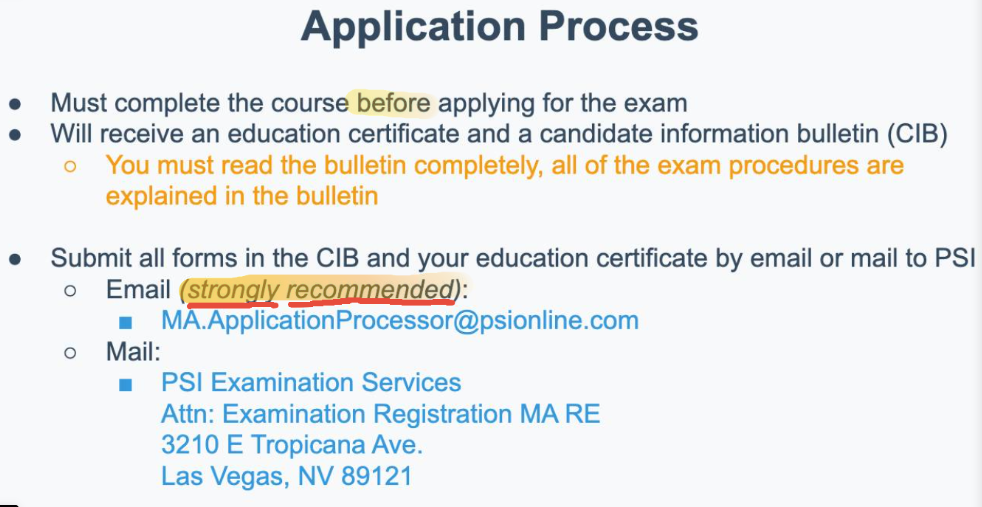

## Application Checklist

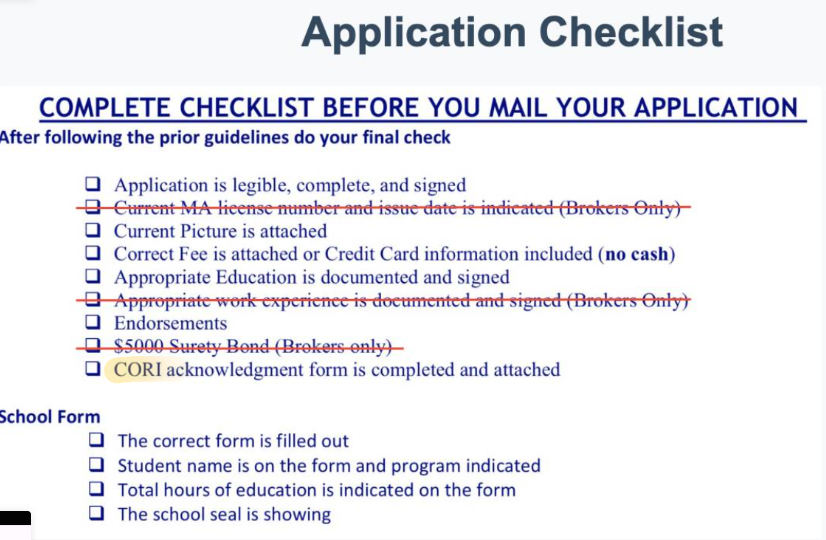

## The Application

### Photo

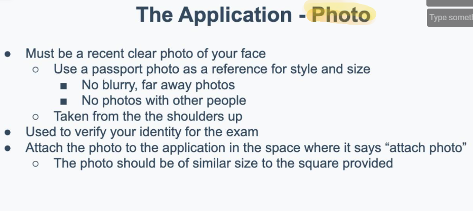

## The Application 

### References

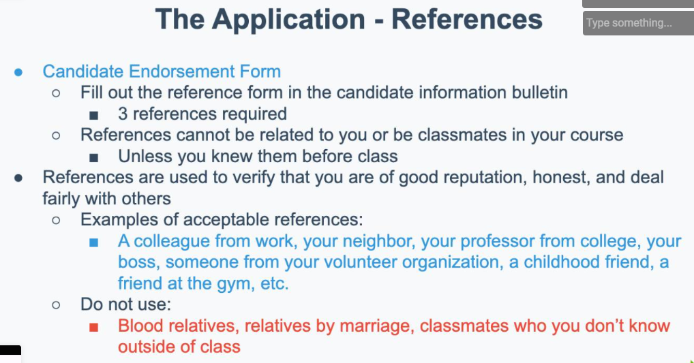

### CORI Form

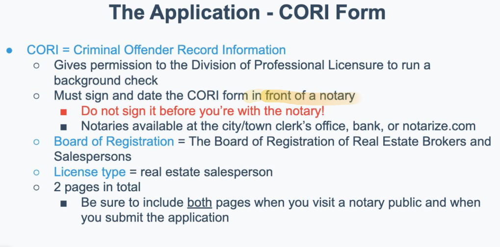

#### Criminal History

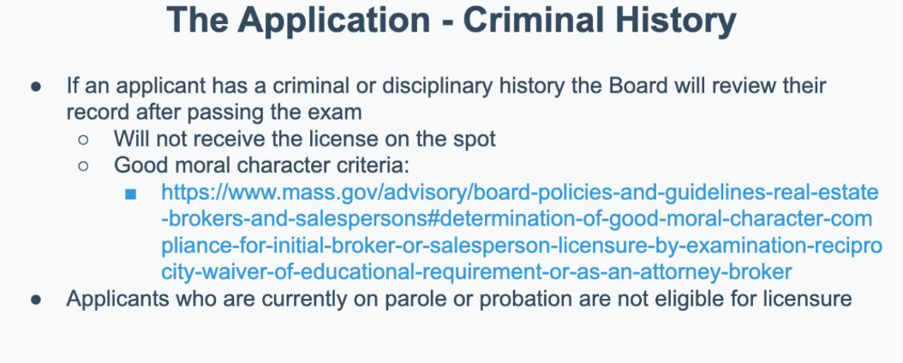

## Approval for the Exam

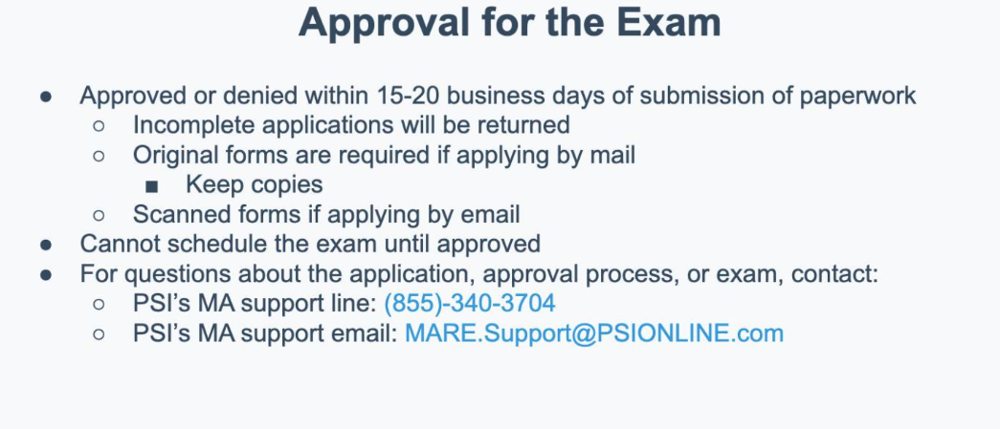

## Cost of the Exam

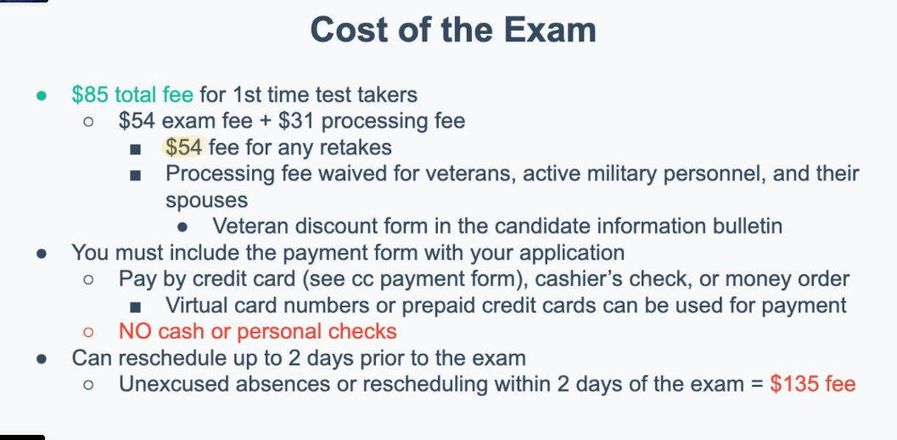

## How to Schedule the Exam

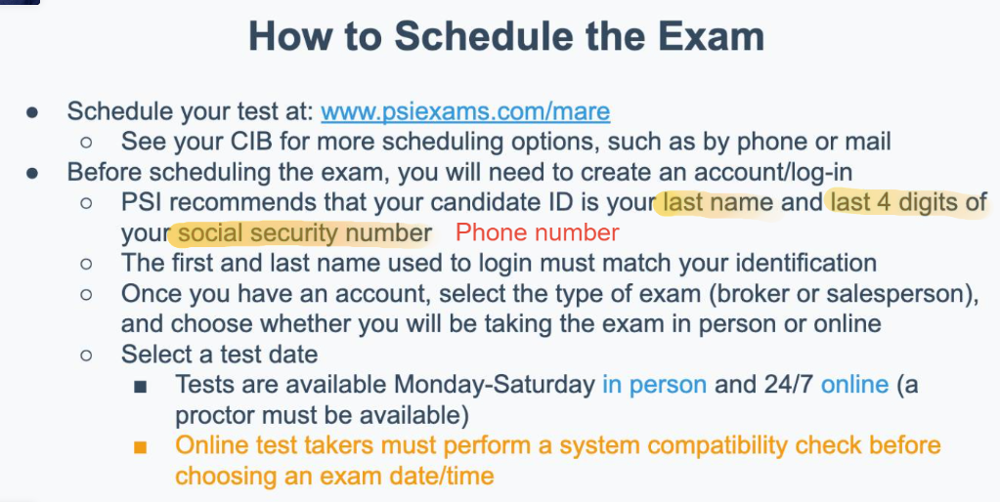

## Identification

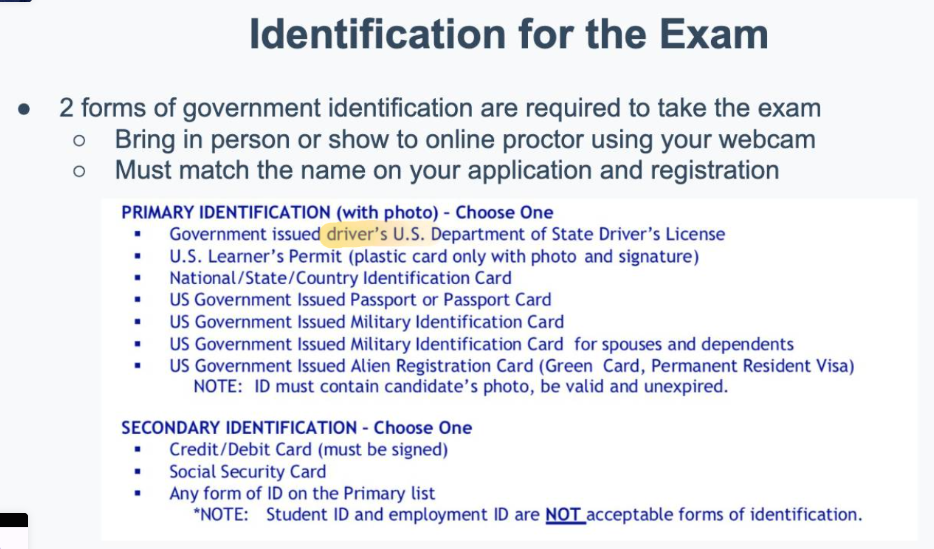

## Online Testing

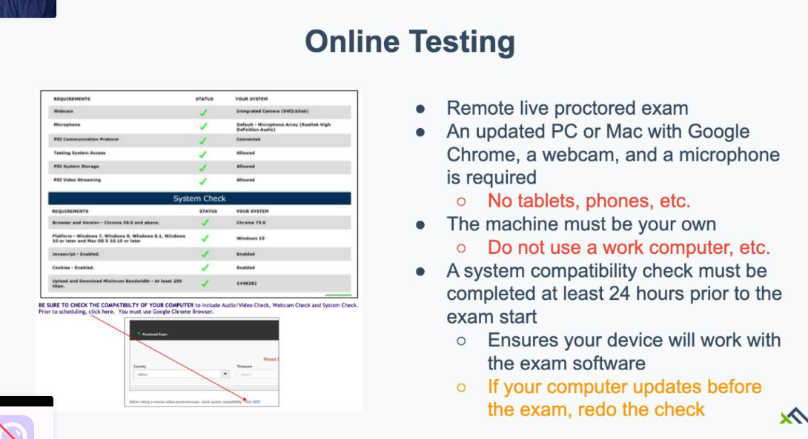

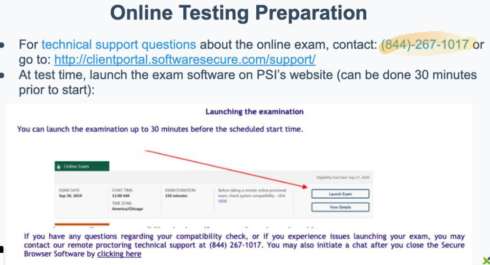

## Online Security Procedures

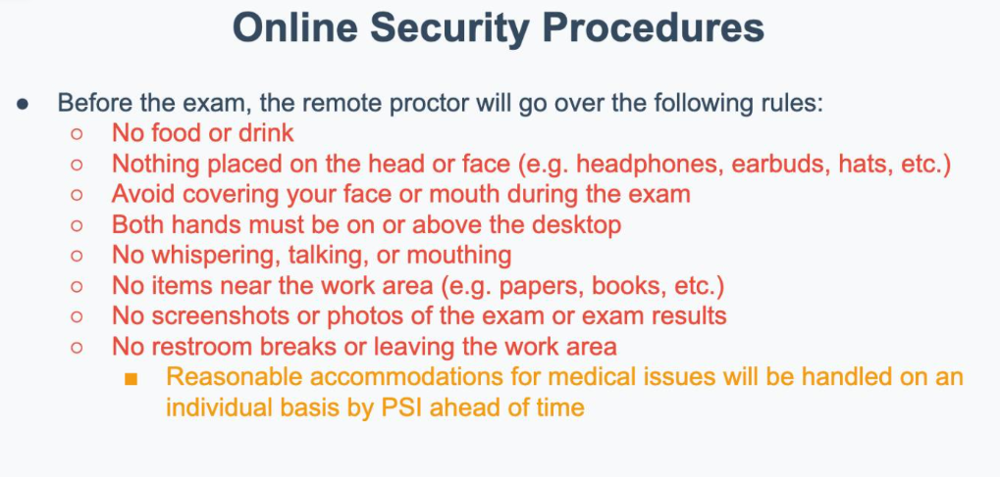

## Taking the Exam

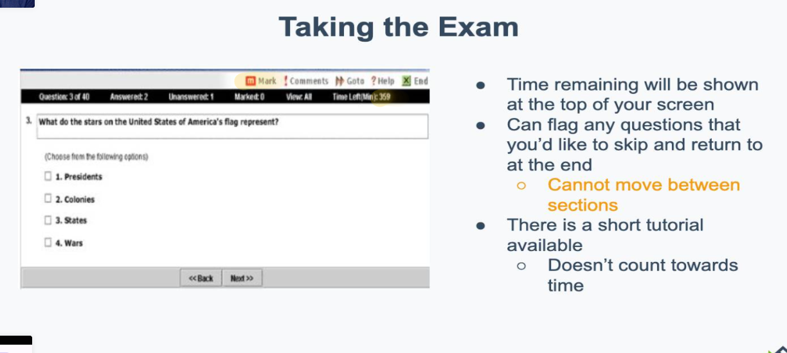

## After the Test

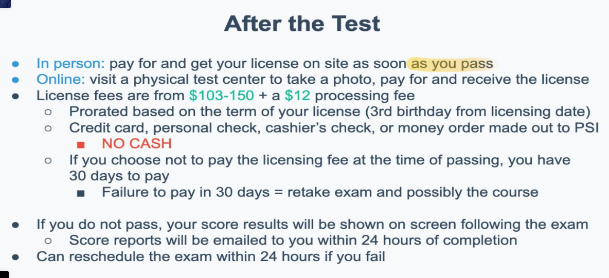

**Disclaimer**: 

> The contents posted here are my own revised version of the class notes. The original class contents and materials (including but not limited to pictures from class slides and study materials) are the property of their respective owners. I am not affiliated with Freedom Trail Reality School. All company, product, and service names used here are for identification purposes only. 

## Index to separate file

1. [The Basics](https://github.com/decilem/MA-RE-LicenseCourseNotes/blob/main/Class%2001%20The%20basis.md)
2. [Property Rights](https://github.com/decilem/MA-RE-LicenseCourseNotes/blob/main/Class%2002%20Property%20Rights.md)
3. [Interests in Real Estate](https://github.com/decilem/MA-RE-LicenseCourseNotes/blob/main/Class%2003%20Interests%20in%20Real%20Estate.md)
4. [Limitations on Property Rights Part 1](https://github.com/decilem/MA-RE-LicenseCourseNotes/blob/main/Class%2004%20Property%20Right%20Limitations%201%262.md)
5. Limitations on Property Rights Part 2 
6. [Transfer of Property Part 1](https://github.com/decilem/MA-RE-LicenseCourseNotes/blob/main/Class%2006%20Transfer%20of%20Property%20Part%201.md)
7. [Transfer of Property Part 2](https://github.com/decilem/MA-RE-LicenseCourseNotes/blob/main/Class%2007%20Transfer%20of%20Property%20Part%202.md)
8. [Contracts](https://github.com/decilem/MA-RE-LicenseCourseNotes/blob/main/Class%2008%20Contracts.md)
9. [Contracts in Practice](https://github.com/decilem/MA-RE-LicenseCourseNotes/blob/main/Class%2009%20Contracts%20in%20Practice.md)
10. [Leases](https://github.com/decilem/MA-RE-LicenseCourseNotes/blob/main/Class%2010%20Leases.md)
11. [Property Valuation Part 1](https://github.com/decilem/MA-RE-LicenseCourseNotes/blob/main/Class%2011%20Property%20Valuation%20Part%201.md)
12. [Property Valuation Part 2](https://github.com/decilem/MA-RE-LicenseCourseNotes/blob/main/Class%2012%20Property%20Valuation%20Part%202.md)
13. [Introduction to Real Estate Financing](https://github.com/decilem/MA-RE-LicenseCourseNotes/blob/main/Class%2013%20Introduction%20to%20Real%20Estate%20Financing.md)
14. [Real Estate Financing](https://github.com/decilem/MA-RE-LicenseCourseNotes/blob/main/Class%2014%20Real%20Estate%20Financing.md)
15. [Government Financing Programs](https://github.com/decilem/MA-RE-LicenseCourseNotes/blob/main/Class%2015%20Government%20Financing%20Programs.md)
16. [Government Financing Regulations](https://github.com/decilem/MA-RE-LicenseCourseNotes/blob/main/Class%2016%20Government%20Financing%20Regulations%20(%E5%90%8E%E5%8D%8A%E8%8A%82%E8%AF%BE).md)
17. [Consumer Protection Laws](https://github.com/decilem/MA-RE-LicenseCourseNotes/blob/main/Class%2017%20Consumer%20Protection%20Laws%E5%89%8D%E5%8D%8A.md)
18. [Real Estate Agency](https://github.com/decilem/MA-RE-LicenseCourseNotes/blob/main/Class%2018%20%20Real%20Estate%20Agency.md)
19. [Real Estate Agency in Practice](https://github.com/decilem/MA-RE-LicenseCourseNotes/blob/main/Class%2019%20%20Real%20Estate%20Agency%20in%20practice.md)
20. [Introduction to Fair Housing](https://github.com/decilem/MA-RE-LicenseCourseNotes/blob/main/Class%2020-22%20Three%20topics%20on%20Fair%20Housing.md)
21. Fair Housing Law (Same with above)
22. Fair Housing in Practice (Same with above)
23. [Massachusetts Real Estate Licensing Law](https://github.com/decilem/MA-RE-LicenseCourseNotes/blob/main/Class%2024%20The%20Massachusetts%20Real%20Estate%20Test.md)
24. The Massachusetts Real Estate Test