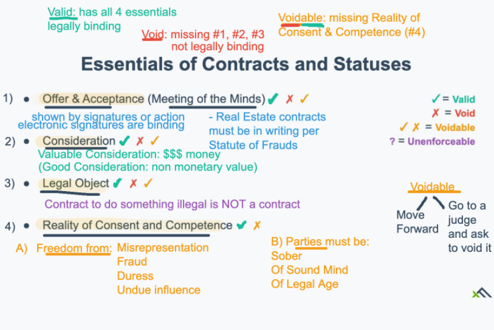

# Class 1 The basis

### Real Estate Transactions
1. list the property
MLS - syndicate to other real estate websites
2. Advertise
3. Quality + Show 	
4. Offer
5. Purchase and Sales (P&S) (+ P&S Deposit)
	* real estate contract 
	* title search, appraisal(if financing), maybe Title V if private sewer, maybe 6D if condo smoke inspection certificate
6. 	Closing 
	* go on record = brokerage gets paid (broker pays salesperson)

### Real Estate Brokerage Relationship 

1. Client (seller_buyer_landlord/tenant)
	* principal: person who hiring 
3. Broker (Special Agent)
4. Salesperson (sub agent)

### Compensation
-  1099 independent contractor (self employed)
  * only paid when sales occurs
  *  tax implications (quarterly tax payments)

> recommendation: hire accountant  
> 	take advantage of write offs (business expense)  
> 	track expense, keep recipes, mileage log, set aside tax $  

### Insurance
#### two main types:
general liability insurance
	* coverage for personal or property damage that might occur at the office/showing
* Prof Liability Insurance
	* errors & omissions or E&O

# Class 2 Property Rights

> Study Guide p.11  

## Outline

* Types of property
* Real property
* Air rights
* Mineral rights
* Riparian rights
* Littoral rights
* Personal Property
* Difference between real and personal property
* Exceptions to the rules
* Changing property types

### Types of Property

* Property = anything subject to ownership
* Two major types of Property
  * Real Property = land and everything with it
    * Real estate, realty, immovable property, fixtures
  * Personal property = anything ~not associated~ with LAND
    * personality, chattel, **moveable** property

### Real Property 

Transferred with a Deed
	* Deed = Receipt for real estate
		* conves legal title (ownership)
	* Grantor vs. Grantee

> or: giver.    ee: receiver  

### Bundle of Rights

Right to Possession (own it)
Right to Control (use it)
Right to  Enjoyment(use it in legal way)
Right to Exclusion (limit access to)
Right to Disposition (rent, sell, will)

### Extended Land Rights

1. Land rights (surface rights) 30ft below

* Appurtenances 
  * chimney, mail box
* Improvement (permanently attached to land) direct or indirect
  * Fixtures

2.  Air rights  (US v Causby)
    * tallest improvement 80ft ~ 500 ft.   (FAA navigable air space)
    * can be leased out
3.  mineral rights (sub surface rights) 
    1. Solid mineral (Gold/silver/iron)
    2. liquid mineral (oil, gas) free flowing

Rules of Capture
	1. Doctrine of Capture: you capture first, you get it first
	2. Utilization Pooling: share it, pool it
Implied easement 

4. Riparians Rights (river)

   1. Ripariansm
      Use in the original 13 colonies 

   * non-navigable (mid points to mid) no boats
   * navigable (accretion line) boats

   2.  Doctrine of Prior Appropriation

   * Use for water rights in Western States
   * First come. First serve

5. Littoral rights

   * Littoral = **L**arge bodies of water (lakes, oceans and ponds)
   * accretion line (high tide)
   * *mass* (special)
     * extend from mean high water line to mean low water line or 100 rods / 1650 feet(whichever is less

6. Personal Property

   * any property not associated with land
   * Bill of Sale = Receipt for personal property

### Personal vs Real Property

1. Attachment: is the property is permanently attached to land? (by nail or rods or directly/indirectly) 
2. adaptability: was it custom build to fit?
3. Intention: what was the intent of the person who installed the property (real or personal) usually more important for trade fixtures
4. Agreement: buyer & seller agree to treat a piece of property as real or personal regardless of that actually is = this overrides other tests
   * Statute of Frauds: Real estate contracts in writing agreements should be in writing.

### Exceptions to the rules

* Trade fixtures = business property = personal property

  * e.g. jewelry display cases 

  > installed for specific business use (commercial)

* emblements = annual or semi-annual crops = personal property

  * e.g. corn or wheat

  > planted with the expectation of being harvested/pulled from  the land

### Changing Property Types

1. Annexation(add) = personal property becomes real property
   * planting a tree
2. Severance () = real -> personal
   * digging up a tree

### checkpoint

1. solar panels: R
2. Shed: R
3. Backyard swing set: R if attached
4. washing machine: P 
5. Refrigerator: P
6. Avocado tree: R
7. Corn crop: P
8. Hair salon chair: P (business)

# Class 3 Interests in Real Estate

## Real Estate

* freehold Interest = Ownership
* Non-Freehold Interest = possessory w/o ownership
  * basically, rental

## Freeholds

1. Fee Simple Absolute
   * default form of ownership
   * own property absolutely
2. Life Estates
   * fee simple ownership for your life
   * pass away, lose property
   * Habendum Clause (物权转让条款)
3. Fee Simple Defeasible
   *  something can cause you to lose ownership
      * e.g. deed resctriction
   *  Determinable = auto
   *  Subject to a condition subsequent = lawsuit

## Severalty

1 person

A freehold interest (ownership) held by only one person. Its root is "severed"; ownership in severalty is the ownership of real estate severed from any co-owners.

## Co-ownership (should review) 

#### 1. Tenancy in Common

* default
* Inheritable 

#### 2. Joint Tenancy

Must：

	* *unity of time* Acquire ownership at same time
	* *unity of title* In the same deed
	* *unity of possession* All have equal right of possession
	* *unity of interest* All have equal interests 
	* Specify joint  ownership

Survivorship

* Last person standing
* Not inheritable

#### 3. Tenancy by the Entirety

* Joint tenancy for married couples
* Creditor protections
  * auto homestead
  * forced sale for debts of one spouse only
* On divorce, automatically become a tenancy in common

#### 4. Condominium

Joint ownership of common areas, and fee simple ownership of units
* Master Deed (condo building)
* Unit deed
* Condo Association
  * Declaration of Trust
  * Bylaws(内部章程) of the Association
* Condo Fees
  * Super-priority lien
  * run with land
  * 6D certificate (what‘s going on the fee)
  * special assessment

#### 4. Cooperatives

* Cooperative(LLC) owns the building

* The people living in the building own stock or shares in the company (or stock certificates)
* The cooperative will have a co-op board like a condominium board of trustees, and owners will pay monthly co-op fees
  for building expenses, similar to condo fees. Banks will typically accept stock in a cooperative as collateral for a loan.

#### 5. Timeshares

* Basically condos for time, rather than space, in the property
* Owner pays maintenance fees
* Also known as interval ownership, a prepaid vacation, or a floating use period.

## Securities 

* shares in companies, debt(bonds), etc.
* RE license doesn't let you broker these

1. Syndications

   * Corporation that invests in 1 or more pieces of RE
   * investors receive returns base on performance of those properties

2. REIT

   Publicly traded portfolio of properties

3. REMIC

   * Trust that holds mortgage
   * Pays investors on the performance of the mortgages

## Non-Freeholds

Basically, rentals

- Leasehold = written conveyance of possession with a fixed timeframe (e.g. a 12 month lease)
- Tenancy at Will = verbal permission that either party may terminate

> In Massachusetts, lessor or lessee must give 30 day notice to vacate in order to terminate a tenancy at will.

- Periodic Tenancy = automatically renews on some pre-agreed interval until terminated (e.g. month to moth)
- Tenancy at Sufferance = holdover tenancy without landlord permission 
  - landlord must evict

> Remember, the terms estate, tenancy, and interest can be used interchangeably

# Class 9 Contracts in Practice (1/12)

Page 33

### Outline

* Listing Contracts
* Buyer Agency Contracts
* Offers
* Purchase and Sale Contracts
* Options
* Rights of First Refusal

## Listing(Selling ) Contract

About employment

####  1. Listing Contract (Broker Employment Contracts)

* Used to hire a real estate agent to sell a home
* Always **negotiable**
* Include: What property the broker is selling, what commission they will be paid, the broker's authority and deadline for the sale

#### 2. Entry Only Listing

* Seller pays a flat fee to put the property on MLS
* Broker offers Limited services to the seller
* Typically, Seller shows their own home and negotiates their own

#### 3. Open Listing

* Seller hires multiple brokers
* Can be verbal or written
* No commission earned if the seller finds a buyer without the broker's help

(For sale by owner)

#### 4. Exclusive Agency

* Seller hires **1 broker**
* Must be in **writing** with an expiration date
* No commission earned if the seller finds a buyer without the broker's help

(Co broke)

#### 5. Exclusive Right to Sell (Most common)

* Seller hires **1 broker**
* Must be in **writing** with an expiration date
* Broker earns a commission and may co-broke
* Seller must pay a commission even if they find  a buyer

## Buyer's Agency Contracts

* Buyer's agency contracts cover exclusivity, but not always commission or payment
  * (most times, buyer's agents are paid by the seller as a co-broke
* Note: on the exam real estate commissions are treated as a cost for the seller
  * But buyers can pay commissions directly to their agent
  * (you could have a min commission in this agreement. If the seller compensation is less than the min, the buyer would make up the difference )

## Offers

* What is the purpose of an offer?
  * To reach an acceptable agreement between buyer and seller, so that the agreement is signed with the intention to move forward
* Offeror: give the offer (buyer, typically)
* Offeree: Seller, typically

> In a counter offer, those roles change

* An offer leads to the signing of a Purchase and Sale Contract (P&S)
  * (memorialized the offer, is the final contract that leads to the sale)
* Verbal offers or acceptance are non binding per __Statute of Frauds__ (All RE contracts must be in writing to be enforceable)
  * All offers must be presented
* Aside from acceptance , offers may be terminated by any of the following: 
  * At end of time limit stated in the offer
  * Death of either party to the offer
  * Destruction of object of offer
  * Withdrawal of offer before it has been accepted in writing
  * Counter-offer
* **Agency relationships** have no effect on the offer
* Binder or letter of intent in some transactions can serve as an offer
  * (very common in new construction)

## Purchase and Sale(P&S) Contracts

* Agreement about how a sale will take place

Page 34

## Options

* Written contract where the owner of piece of property grants another party the right to purchase or lease the property
* Consideration exchanged 
* Certain time frame at pre-agreed terms (At end of the lease, you can purchase the property for 400k )
* What type of contract is an option?
* ....

## Other Real Estate Contracts

* Right of First Refusal
  * A right of first refusal gives a prospective buyer the right to match any offers made on a property
  * right doesn't give the buyer control over what price or terms the property sells for
  * allow the seller to track the market and ensure fair market value
* Right of First Offer (page 35)
  * Prospective buyer is offered the "first right" to purchase a property
* Power of Attorney
  * Written document giving the *right to act as a proxy*(they can do things just like they are you) for another 
  * Creates attorney-in-fact

# Class 4 Property Right Limitations 1

Page. 18

## Government Limitations

### P.E.T.E

#### 1. Police power

* the right of government to regulate private activity if it's in public interest to do so.
* Zoning = governs land use
  * e.g. use(residential, commercial, etc), height, setbacks, visual appearance, lot sizes, parking, open space, density, FARs, etc
  * 3 ways around zoning: 
    1. **on-conforming use**: A legal use that existed prior to the enactment of current zoning ordinances
    2. **variance**: Special permission to do something otherwise forbidden by the zoning rules
    3. **conditional use permits**: Think of this as a limited variance. Conditional use permits (CUPs)
       allow a commercial or residential use
* Building codes = govern how you build
  * Building codes define basic requirements for construction without necessarily prescribing implementation
  * Certificate of Occupancy (C/O) = proves that the property was built up to code and is safe for occupancy

#### 2. Eminent Domain (土地征用权)

* Right of government to force the sale of privately owned property 

#### 3. Taxes

**municipal property taxes**

* Taxes assessed against your property by the town or city (municipality)

* Pay for most of the things the town or city does

* Taxes run with land

  * Towns can foreclose for unpaid taxes
  * Superpriority lien
  * Equitable right of redemption= 1 year from the date of sale

* Taxes are charged on the assessed value of your property

* Taxes are charged in mills ($1 per $1,000)

* Paid quarterly or semi-annually on a fiscal year running from July 1 to June 30th (8/1, 11/1, 2/1, 5/1 in MA)

  Special Assessments = charges for improvements made to your property by the town 

  > e.g. sewer hookup, or street lighting ("betterments")

* Special Districts = tax districts that charge adjacent homeowners for services they receive

*Math: Property taxes*

>What is the annual property tax on a $100,000 home that is assessed at 40% of its value in a town with a millage rate of $20 per $1000?

$100,000 * 0.4 = $40,000 assessed value

$40,000 / $1,000 = 40 payments * $20 = $800 tax bill

> What is annual property tax on a $250,000 home assessed at 50% with a mileage rate of $15 per $1,000

$250,000 * 0.5 = $125,000 assessed value

$125,000 / $1,000 = 125 payments * $15 = $1,875

#### 4. Escheat (充公)

* reversionary interest in all privately owned property held by the state

## Private Limitations

Private limitations or restrictions (also known as CC&Rs) are contractual limitations on ownership created by deed or separate agreement. There are two basic kinds:

1. Covenants = contractual limitations in a subdivision
   * Must be uniformly applied to all the owners
2. Deed restrictions = contractual limitations written into your deed (receipt)
   *  Violation of a restriction can result in a lose of title

## Conflicts Between Public and Private Limitations

If there is ever a conflict between private restrictions and public zoning, the more restrictive rule wins. So, if a private restriction limits homeowners to 2.5 story buildings, but public zoning allows up to 3 stories, the homeowner would
be limited to 2.5 stories. 

## Environmental Limitations (p.20)

##### Comprehensive Environmental Response, Compensation, and Liability Act of 1980 (CERCLA)

Superfund Act.

##### Leaking Underground Storage Tank Program (LUST)

Underground Storage Tank program

##### MA Oil and Hazardous Material Release Prevention and Response Act (Chapter 21E)

##### The Clean Water Act of 1972 (CWA) 

Regulates pollution of navigable (and connected) waters. 

[Cuyahoga River Fire](http://www.ohiohistorycentral.org/w/Cuyahoga_River_Fire)

##### National Flood Insurance Program (NFIP)

Requires property owners in "high risk flood zones" (think: waterfront property) to purchase flood insurance if their community participates in the NFIP and if they have a federally backed mortgage.

[Flood Money](https://www.npr.org/sections/money/2017/09/29/554603161/episode-797-flood-money)

##### Massachusetts Wetlands Protection Act 

The act requires a buffer zone (an area where you cannot build anything) of 100 feet from any wetlands. The DEP or local conservation commission may permit certain minor changes after 50 feet, and may also permit certain changes within the buffer zone, subject to DEP regulations, though typically no changes may be made to the wetland itself.

[MA Wetland and Wetland Change Areas Map](http://maps.massgis.state.ma.us/images/dep/omv/wetviewer.htm)

##### Coastal Zone Management Act (CZMA)

A federal law designed to protect coastal zones (like the Gulf of Mexico or
Long Island Sound) from the harmful effects of real estate development. It limits, or completely eliminates, development in those zones.

##### LEED Certification

### Environmental Vocabulary

* Accretion – An increase of property by the gradual, natural action of wind or water (e.g. the slow increase of a beach).
* Aeolian Soil – Soil deposited by wind, such as sand dunes or silt.
* Alluvion – An increase of land area along a shore by deposited alluvium or by the recession of water (e.g. the slow increase of a riverbank).
* Alluvium – Any clay, silt, sand, gravel, or similar detrital material (sand, rocks, gravel, etc.) deposited by running water.
* Avulsion – The sudden separation of land from one property or its attachment to another, usually caused by flooding, a storm, or a change in the course of a river.
* Erosion – The process by which the surface of the earth is gradually worn away by natural actions (e.g. water, wind,etc.).
* Reliction – An increase of the land by the **sudden retreat** of the sea, lake, river, or other body of **water** (e.g. a sudden decrease in the water table).

## Other Property Right Concerns (p.22)

#### Easements

* Rights of way across another's property
* "Run with the land"
* Easements appurtenant = 2 adjacent lots of land
  * 4 ways to create:
    1. Deed
    2. Implication
    3. Necessity
    4. Prescription
* Easements in gross = personal held easements

#### Licenses

Personal, revocable and non-assignable permission to enter someone else's property for a particular purpose (e.g. ticket holders in sporting events).

#### Encroachments

The intrusion of an improvement onto a neighboring property (e.g. a misaligned fence). Failure to take action against an encroachment may result in a loss of the land (again via O.N.C.H.A. with a 20-year time frame).

## Financial Limitations (Liens)

* General Lien = covers ALL property (Personal + Real)
* Specific Lien = covers just one piece of property (usually real estate)

#### Voluntary Liens

* Mortgage = lien for the purposes of securing a real estate loan
  * Mortgagor = borrower, mortgagee = bank
* Installment Sales Contracts = agree to make payments for property. and don't legal title until you make your final payment
  * Equitable title = a future right to acquire legal title

#### Involuntary Liens

* Property Tax Liens = lien for unpaid property taxes
* Federal Tax liens = general liens for delinquent federal taxs
  * Estate Tax liens = liens against an estate for unpaid taxes
* Mechanic's Lien = a protection for contractors against non-payment
* Judgments = final decision by a court, can result a sheriff's sale
* Attachments = legal seizure of property to satisfy a possible judgment 
  * Lis Pendens = recorded notice of the attachment

# Class 6 Contracts and Contracts in Practice

p.31 1/25/2021

## Contracts

What is contracts?

* legally binding agreements between two or more parties
* Performance: doing what you promised

## Essentials of contracts and Statues

Valid: has all 4 essentials legally binding

Voidable: missing reality of consent & competence

Void: missing #1 #2 #3 not legally binding

#### 1 Offer & Acceptance (meeting of the minds)

- Shown by signatures or action electronic signatures are binding

- Real Estate contracts must be in writing per Statute of Frauds 

#### 2 Consideration

#### 3 Legal Object

#### 4 Reality of Consent and Competence

